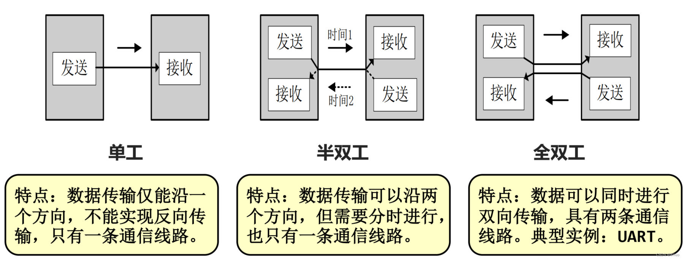
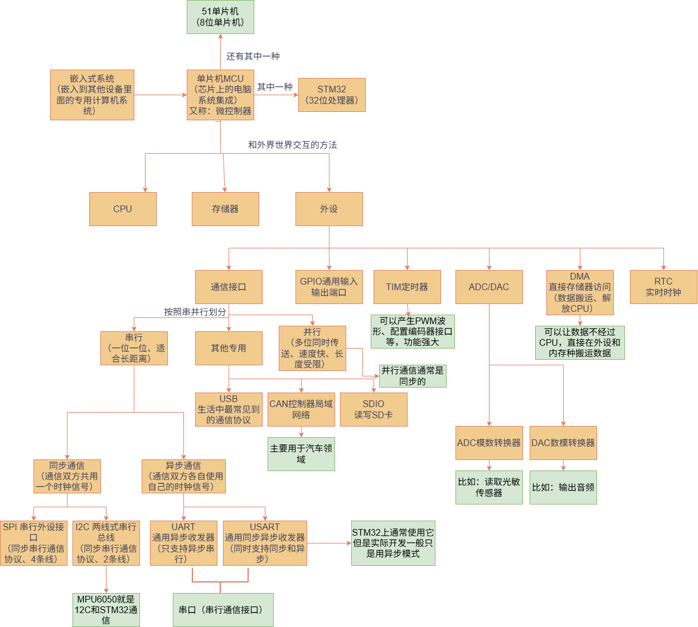
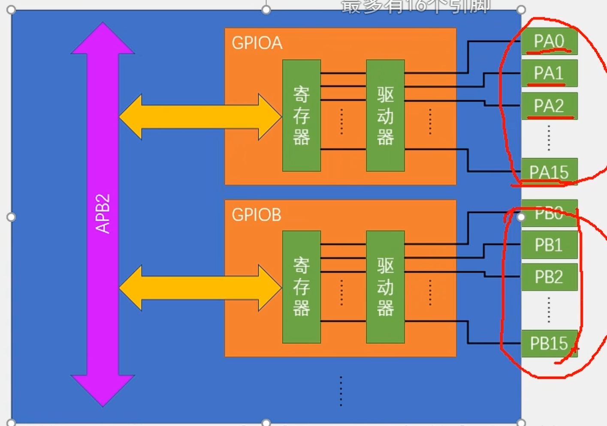
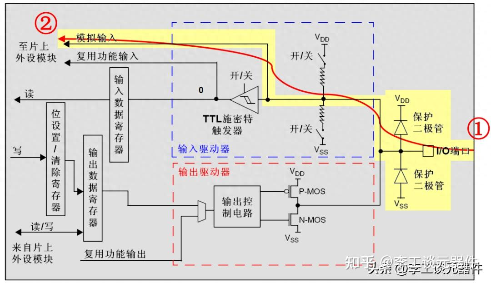
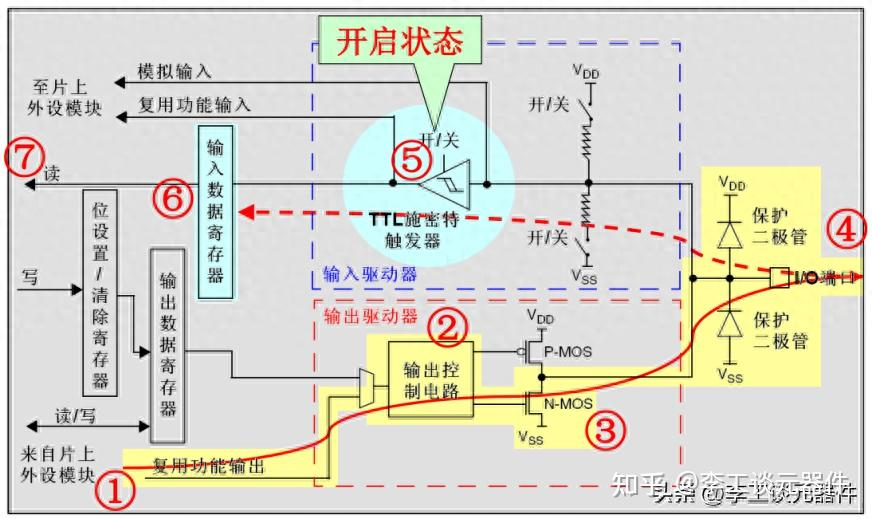
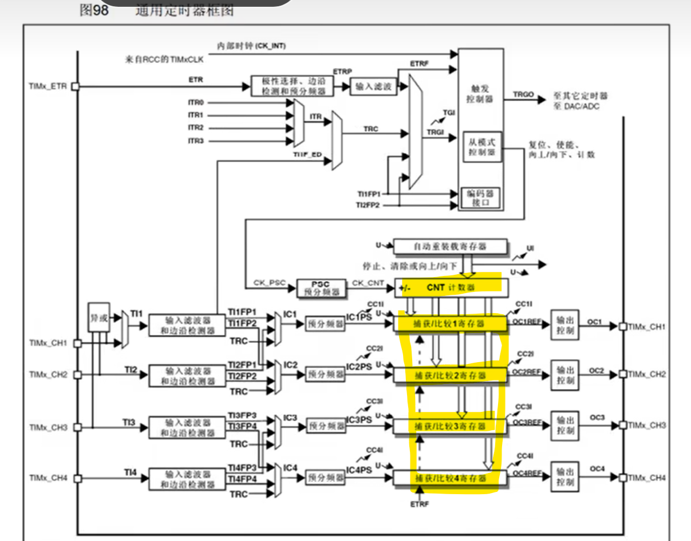
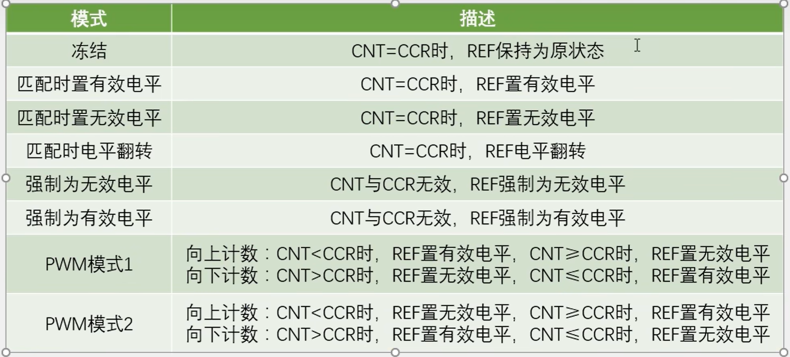
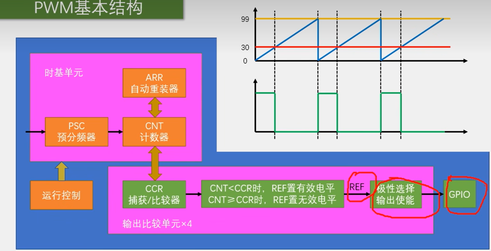
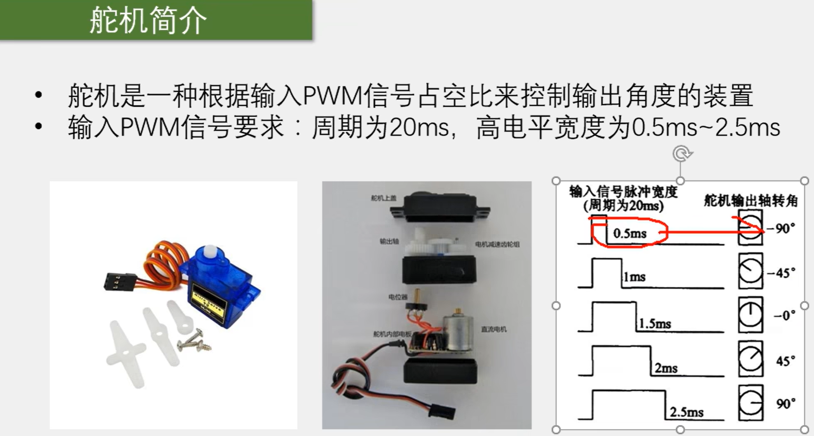

# 嵌入式工作室2026年暑期招新 Robotics方向

----------------------

## 第一部分

----------------------

## 一、各概念详解

### 1. 嵌入式系统

**定义**：嵌入式系统是以应用为中心，以计算机技术为基础，软硬件可裁剪，适用于对功能、可靠性、成本、体积、功耗有严格要求的专用计算机系统。简单说，就是**嵌入到其他设备内部、专门干某一件事情的“小电脑”** 。

**身边的嵌入式设备**：手机、智能手表、路由器、数字电视、微波炉、冰箱、洗衣机、汽车导航、ATM机、无人机、扫地机器人等。

**核心特点**：专用性（不像PC什么都能干）、软硬件可裁剪、功耗体积受限、可靠性要求高。


### 2. 单片机 与 STM32

**单片机（MCU）** ：将一个计算机的CPU、存储器、各种I/O接口全部集成到一块芯片上的微型计算机。通俗理解就是**一个芯片上集成了完整的微型电脑系统**。

**STM32**：是ST（意法半导体）公司基于ARM公司授权的**Cortex-M内核**生产的32位单片机。“STM32”这个名字的含义：
- **ST** = 意法半导体（芯片制造商）
- **M** = Microcontroller（微控制器）
- **32** = 32位处理器

**它们的关系**：**STM32是单片机的一种**。单片机是大的品类（还包括51单片机、AVR、PIC等），STM32是其中性能较强的一个系列。如果说51单片机是8位的“入门级”，STM32就是32位的“进阶版”，速度更快、资源更多、功能更强。

> **补充理解**：ARM是一家**半导体知识产权公司**，只设计内核不生产芯片；ST是**半导体厂商**，买下ARM的内核授权，再自己加上存储器、外设等，做成完整的STM32芯片。


### 3. 冯·诺依曼结构 与 哈佛结构

这两种结构描述的是**CPU如何访问指令和数据**。

| | 冯·诺依曼结构 | 哈佛结构 |
|---|---|---|
| **指令与数据存储** | 存**在同一**存储器中 | 存在**不同**的存储器中 |
| **总线** | 共用一条总线 | 独立的指令总线和数据总线 |
| **能否同时取指令和取数据** | **不能**（要排队） | **能**（并行） |
| **速度** | 较慢 | 较快 |
| **代表** | X86架构、ARM7 | **STM32（Cortex-M3）** 、ARM9、大部分DSP |


**STM32内核采用的是哈佛结构**。Cortex-M3内核拥有独立的指令总线和数据总线，可以让取指与数据访问并行进行，提升效率。


### 4. 各术语详解与关系梳理

下面这16个术语可以分为**三类**来理解：

#### 第一类：MCU与外设（整体与部分的关系）

- **MCU（Microcontroller Unit，微控制器）** ：就是单片机。它是**核心**，包含了CPU、存储器、和各种**外设**。
- **外设（Peripheral）** ：集成在MCU芯片内部的功能模块，如GPIO、定时器、ADC、串口等。

**关系**：MCU = CPU + 存储器 + 各种外设。外设是MCU的“器官”，MCU通过外设与外部世界交互。


#### 第二类：通信方式（并行/串行、同步/异步）

- **并行通信**：数据的多个位**同时**在多条线上传输（比如8位数据同时用8根线传）。速度快，但占用的引脚多、线路长度受限。
- **串行通信**：数据**一位一位地**在单条线上顺序传输。速度慢一些，但引脚少、成本低、适合长距离。

- **同步通信**：通信双方**共用同一个时钟信号**，数据的收发由这个时钟来同步。效率高，但对时钟精度要求高。
- **异步通信**：通信双方**各自使用自己的时钟**，依靠数据帧中的起始位、停止位来约定节奏（如UART）。对时钟精度要求低，但每帧有额外的开销。

**关系**：串行通信可以是同步的（如SPI、I2C），也可以是异步的（如UART）。并行通信通常也是同步的。

> 通信补充：
> 传输模式：单工、半双工（数据传输可以沿两个方向，但是需要分时间进行、只有一条路径）、全双工（两条通信线路）
> 
> IIC的通信协议的三根信号线：GND+SCL+SDA


#### 第三类：具体外设与接口

##### GPIO（通用输入输出端口）
STM32与外界交互的最基本接口，引脚可以配置为**输入**（读取外部信号）或**输出**（对外输出高低电平）。是你点灯、读按键的基础。

##### 串口 / UART / USART
- **串口**是**统称**，指串行通信接口。
- **UART**（通用异步收发器）：只支持**异步**串行通信。
- **USART**（通用同步异步收发器）：同时支持**同步和异步**串行通信，比UART更强大。

**关系**：USART是UART的升级版。STM32上通常用USART，但实际开发中大多只使用它的异步模式（当成UART用）。

##### DMA（直接存储器访问）
可以让数据**不经过CPU**，直接在**外设和内存之间**搬运数据。比如你要把串口收到的一大串数据存到内存里，用DMA的话CPU可以去做别的事，DMA自己就把活干完了。**核心价值：解放CPU**。

##### ADC（模数转换器）
将**模拟信号**（连续变化的电压）转换为**数字信号**（CPU能处理的数值）。比如读取光敏传感器、电位器的电压值。

##### DAC（数模转换器）
将**数字信号**转换为**模拟信号**（输出电压）。是ADC的逆过程，比如用来输出音频信号。

##### TIM（定时器）
STM32里的定时器功能非常强大，可以：计时、测量频率、**产生PWM波形**、配置编码器接口等。是你做呼吸灯、控制舵机的核心外设。

##### RTC（实时时钟）
在STM32内部完成**时分秒的计时**功能，可外接备用电池实现**掉电后继续走时**。

##### SDIO
SD卡接口，用于**读写SD卡**。

##### USB
生活中最常见的通信协议，STM32上通常作为**从设备**与电脑通信。

##### CAN（控制器局域网络）
主要用于**汽车领域**的通信协议，抗干扰能力强。

##### SPI（串行外设接口）
**同步串行通信**协议，使用4条线（时钟、数据出、数据入、片选），速度较快，适合连接高速设备。

##### I2C/IIC（两线式串行总线）
**同步串行通信**协议，只用2条线（时钟SCL、数据SDA），支持**多设备挂载**在同一总线上。MPU6050就是通过I2C与STM32通信的。

>起始位：当SCL是高电平时，SDA从高到低的跳变
停止位：当SCL是高电平时，SDA从低到高的跳变


### 三、概念关系



-----------------------------

## 第二部分

-----------------------------

### 项目包1：

1 使用库函数点亮 STM32F103C8T6 最小系统板上的板载LED灯。
用按键实现LED的可控闪烁。

3 使用delay函数完成led以特定频率闪烁。

2 用GPIO实现流水灯效果。

4 使用光传感器实现“天亮灯灭，天暗灯亮”的功能。

### 项目包2：

使用PWM完成呼吸灯效果


#### 重点知识补充：

1.GPIO

（1）可配置为8种输入输出模式：

带FT就是可以输入5V电压的，其他都是只能3.3V的输入，但是都是只能输出-或者3.3V的。


STM32是32位的寄存器，所有有32位，但是端口有16位，所以寄存器只有低16位对应有端口


##### （2）具体：

1） GPIO_Mode_AIN 模拟输入；
2） GPIO_Mode_IN_FLOATING 浮空输入；
3） GPIO_Mode_IPD 下拉输入；
4） GPIO_Mode_IPU 上拉输入；
5） GPIO_Mode_Out_OD 开漏输出；
6） GPIO_Mode_Out_PP 推挽输出；
7） GPIO_Mode_AF_OD 复用开漏输出；
8） GPIO_Mode_AF_PP 复用推挽输出。

**【器件解释】**

1、保护二极管

1IO引脚上下两边两个二极管用于**防止引脚外部过高、过低的电压输入**。

2.TTL 肖特基触发器

信号经过触发器后，模拟信号转化为 0 和 1 的数字信号。
但是，当 GPIO 引脚作为 ADC 采集电压的输入通道时，用其**模拟输入功能**，此时信号不再经过触发器进行TTL电平转换。（可以理解为一个比较器，大于某个值是1，小于某个值是0）

查看《STM32中文参考手册V10》中的GPIO的表格时，会看到有“FT”一列，这代表着这个GPIO口时兼容3.3V和5V的；如果没有标注“FT”，就代表着不兼容5V。

##### （3）STM 32 GPIO 八种工作模式
1、模拟输入 GPIO_Mode_AIN
此模式可以检测外部输入的模拟电压，可以检测电压值，只要不高于Vcc即可。


2、浮空输入 GPIO_MODE_IN_FLOATIN
此模式最常用的是检测按键，可以接收高低电平。但容易被干扰。

3、下拉输入GPIO_Mode_IPD
此模式检测到电平默认为低，可以检测到由低到高的电平变化。

4、上拉输入GPIO_Mode_IPU
此模式检测到电平默认为高，可以检测到由高到低的电平变化。

5、开漏输出GPIO_Mode_Out_OD
开漏输出用于输出低电平，高电平靠外部上拉电阻电压决定，适用于快速切换电压的外部电路结构。


6、推挽输出GPIO_Mode_Out_PP
推挽输出用于输出高低电平，是最常用的模式。

7、复用开漏输出GPIO_Mode_AF_OD
复用 IIC 时候选择复用开漏输出，因为开漏输出可以“线与”。


8、复用推挽输出GPIO_Mode_AF_PP
其他复用比如 SPI 等可以选择复用推挽输出。

```markdown
区别开漏输出和推挽输出这两个常用的：

**开漏输出的速度比推挽输出慢得多**，它真正厉害的地方是 **“电平转换”** 和 **“多设备共线（线与）”**。

### 1. 推挽输出（GPIO_Mode_Out_PP）——强硬！！！
- **内部结构**：芯片内部有一个**P-MOS管（负责接高电平VDD）** 和一个**N-MOS管（负责接低电平VSS）**。
- **工作逻辑**：
  - 输出`1`（高电平）：P-MOS导通，N-MOS关闭，**直接短路到3.3V电源**，强力输出高电平。
  - 输出`0`（低电平）：P-MOS关闭，N-MOS导通，**直接短路到地（GND）**，强力输出低电平。
- **特点**：高低电平都有强驱动能力，**上升沿和下降沿都非常陡峭**，速度快。适合点灯、驱动舵机（PWM）、驱动蜂鸣器。
- **死穴**：**不允许两个推挽输出引脚直接连在一起！** 如果A输出高(3.3V)，B输出低(0V)，两个P-MOS和N-MOS同时导通，相当于**电源直接对地短路**，瞬间大电流会把芯片烧掉。

### 2. 开漏输出（GPIO_Mode_Out_OD）
- **内部结构**：芯片内部**只有1个N-MOS管**，**没有P-MOS管**。上面是断开的（高阻态）。
- **工作逻辑**：
  - 输出`0`（低电平）：N-MOS导通，**强力拉到GND**。
  - 输出`1`（高电平）：N-MOS**完全关闭**，引脚处于**高阻态（Hi-Z）**，内部相当于把引脚“断开”了。**芯片自己绝对不输出高电平！**
- **高电平怎么来**：**必须在外部加一个上拉电阻（比如4.7KΩ或10KΩ）**，电阻的另一头接想用的电压（可以是3.3V，也可以是5V）。N-MOS关闭时，引脚就被电阻拉到了这个外部电压。

---

开漏输出依赖外部上拉电阻，而上升沿的电压是通过**电阻给寄生电容充电**建立的。电阻越大，上升越慢（几微秒）；电阻越小，上升快但功耗大。
- **推挽速度**：纳秒级（极快）。
- **开漏速度**：微秒级（较慢）。所以它**绝对不适合高速通信**（比如SPI的高速模式）。I2C标准模式只用400kHz，就是因为开漏跑不快。

---

### 3. 既然开漏慢又麻烦，为什么还要用它？

**原因一：用来匹配不同电压的外部设备（电平转换）**
你的STM32是3.3V逻辑，但有些老式模块（或OLED）可能需要5V电平。开漏模式下，**STM32内部不输出高电平**，高电平完全由外部上拉电阻决定。
- 如果你想把3.3V单片机接到5V的I2C设备，只需在SDA和SCL上加**上拉电阻到5V**。STM32内部输出低电平时拉低到0V，输出高电平时“放手”让5V电阻拉上去。**完美实现电压匹配，还不伤芯片。**

**原因二：支持“线与”总线（多设备不打架）——这是I2C（MPU6050）必须用开漏的根本原因！**
I2C总线上挂了很多设备（MPU6050、OLED等）。如果主机和从机都用推挽输出：
- 主机想发1（拉高），从机想发0（拉低），瞬间电源短路，**芯片必烧**。
用了开漏模式：
- 主机发1时：N-MOS关闭（放手）。
- 从机发0时：N-MOS导通（拉低）。
- **结果**：因为主机关闭了，从机能轻松把总线拉低；反过来也一样。没有任何短路电流。

**结论**：I2C协议**强制要求**信号线（SCL、SDA）必须配置为**开漏输出**，配合外部上拉电阻。这就是为什么之后做MPU6050时，一定要在PB6/PB7上接两个4.7K电阻，并且在初始化GPIO时用 `GPIO_Mode_AF_OD`（复用开漏输出）。

---

### 4. 针对这一项目的选择
| 场景 | 用哪个模式 | 为什么 |
| :--- | :--- | :--- |
| **点亮LED / 驱动舵机PWM** | **推挽输出** | 需要大电流驱动，速度要快，电平稳定。 |
| **按键输入检测** | 输入模式（上拉/下拉） | 输出模式是用于控制外部电路，读按键要配输入模式，别配错了。 |
| **MPU6050 的 I2C 通信** | **复用开漏输出** | I2C协议强制要求，必须配合外部上拉电阻，防止总线冲突烧芯片。 |
| **蓝牙 HC05 的 TX/RX** | **复用推挽输出（TX） / 浮空输入（RX）** | 串口是点对点通信（一对一），只有一个发一个收，不存在总线冲突，用推挽跑得快。 |

开漏输出用于输出低电平，高电平靠外部上拉电阻电压决定，适用于需要进行电平转换（匹配3.3V/5V）以及需要多设备共线（如I2C总线）的场景。
```

----

### 项目包1-2的重要代码解释部分【附件1】

按键函数

PWM呼吸灯函数

光感受器函数

---

## 附加题

项目包3：
使用OLED显示你的学号、姓名，并且使用OLED显示一张图片

### 学习笔记：

### 1.OLED

#### 1）工作原理：OLED是一种利用有机材料发光的显示技术

（1）两个电极：一个是透明的阳极（通常用ITO材料），另一个是金属阴极。
（2）有机发光层：夹在两个电极之间，厚度仅有几十纳米。

>当给它通电时：
阴极会注入电子（带负电），阳极会注入空穴（可以理解为带正电的“空洞”）。
在电场作用下，电子和空穴会相向移动，在中间的有机发光层里相遇并结合。
它们结合时释放的能量会激发有机分子，分子从激动状态回到稳定状态时，就会以光的形式释放出多余的能量。
光的颜色由有机发光材料决定，而亮度则由电流大小控制。

（3）特点：OLED是自发光的

#### 2）OLED显示中文

（1）背景：内部只内置了英文字母和数字的字模（ASCII字符集），必须为要显示的中文提供“字模”（即每一个汉字在OLED上的点阵图案数据）

（2）方法：详见项目包3

-----------------

## 第三部分：项目一————舵机云台

### 挑战点一：使用PWM驱动舵机

项目包4

---

#### 学习笔记

##### 1.TIM的输出比较——有电机的项目重点，比如：PWM驱动电机

英文缩写（常见的）：OC  


---

##### 2.PWM——脉冲宽度调制
简而言之使用PWM呼吸灯来讲，就是快速多次的进行高低电平的交替，使得呈现一种中等亮度（一种等效的模拟量）

要求：具有惯性的系统（如：呼吸灯、电机）

参数：频率、占空比（高电平占一个周期内的时间长度）、分辨率（占空比变化的细腻程度）


2-4可以用于形成PWM的波形，2-3是输出一次性的信号，1和5-6都是用于暂停


这张图是一个**STM32定时器PWM生成的核心原理框图**，它把“时基”、“比较”和“输出路径”三个环节串在了一起。

---

###### 图片知识解释：
- 纵坐标代表 **计数器（CNT）** 的数值。
- 假设 **ARR（自动重装器）= 99**，那么 CNT 就会从 **0** 一直往上数到 **99**，然后溢出归零，重新再数（即 **0 → 30 → 99 → 0** 的三角波/锯齿波）。
- 图中的 **30** 代表写入 **CCR（捕获/比较器）** 的当前值。


这个 REF 信号就是一个**占空比 = 30 / (99+1) ≈ 30%** 的原始方波。
**CCR 的值决定了高电平持续多久（占空比）**，这就是 PWM 的核心。


>图里横坐标指向了 **REF → 极性选择 → 输出使能 → GPIO**，这代表原始信号 `REF` 要经过“三关”才能变成引脚上的实际电压：
>1. **REF（原始信号）**
>2. **极性选择**：你可以选择“不反转”（高电平有效）或“反转”（低电平有效）。你代码里写的 `TIM_OCPolarity_High` 就是告诉硬件“别反转，直接过”。
>3. **输出使能**：相当于一个总开关，只有开启（`TIM_OutputState_Enable`），信号才能往外送。
>4. **GPIO**：最终信号到达物理引脚（如 PA1），变成示波器上看到的实际波形。


**一句话总结**：**PSC 和 ARR 决定方波的“周期”（多宽），CCR 决定方波的“宽度”（高电平多长），REF 经过极性和使能后从 GPIO 输出。** 


**【注意重点！！！】**
这三个公式并非凭空定义，而是由定时器的 **硬件计数原理** 直接推导出来的。简要推导如下：

###### 1.频率公式的来源
\[
F_{PWM} = \frac{CK\_PSC}{(PSC + 1) \times (ARR + 1)}
\]

- **计数脉冲**：定时器时钟 \( CK\_PSC \) 先经过预分频器 \( PSC \) 分频，得到实际驱动计数器的时钟频率：  
  \[
  f_{CNT} = \frac{CK\_PSC}{PSC + 1}
  \]
- **一个周期**：计数器从 \( 0 \) 向上计数到 \( ARR \) 需要计 \( (ARR + 1) \) 个数，每个数耗时 \( 1/f_{CNT} \)


###### 2. 占空比公式
\[
Duty = \frac{CCR}{ARR + 1} \times 100\%
\]

- 计数器从 \( 0 \) 跑到 \( ARR \)（共 \( ARR+1 \) 个计数值）。
- 输出电平在 \( CNT < CCR \) 时有效，有效时长对应 \( CCR \) 个计数值。


###### 3. 分辨率公式的来源
\[
Resolution = \frac{1}{ARR + 1}
\]

- \( CCR \) 寄存器只能按 **整数 1** 变化，这是硬件限制的最小调节步长。
- 当 \( CCR \) 变化 1 时，占空比的变化量为：  
  \[
  \Delta Duty = \frac{(CCR + 1) - CCR}{ARR + 1} = \frac{1}{ARR + 1}
  \]
- 这个最小变化量即为该 PWM 能达到的控制精度（分辨率）。
  

---
##### 3.舵机介绍



-----
#### 挑战一思考题回答

#### 1. PWM由什么外设产生？核心参数有哪些及作用？
- **产生外设**：**定时器**（通用/高级定时器）的**输出比较通道**产生。本质是利用计数器（CNT）与比较寄存器（CCR）数值匹配时翻转电平。
- **三大核心参数**（由时基+比较器决定）：
  - **频率**（\( F_{PWM} \)）：由 **PSC** 和 **ARR** 共同决定，决定方波快慢（舵机要求 50Hz）。
  - **占空比**（Duty）：由 **CCR** 决定，决定高电平占比（控制舵机转角）。
  - **分辨率**（Resolution）：由 **ARR** 决定，决定 CCR 每变化 1 时占空比的最小步进（决定转动细腻度）。

---

#### 2. PWM输出对应的GPIO配置模式？与普通推挽核心区别？
- **配置模式**：**复用推挽输出**（`GPIO_Mode_AF_PP`）。
- **核心区别**：
  - **普通推挽输出**：引脚电平由 **CPU 写 ODR 寄存器** 控制，软件翻转速度慢且占用内核资源。
  - **复用推挽输出**：引脚电平由 **片上外设（定时器）直接硬件驱动**，断开 CPU 控制。定时器以纳秒级硬件速度自动翻转电平，且不占用 CPU 算力，这是产生高频稳定 PWM 的根本原因。

>需要**人为干预、随性变化、或简单开关”**（如点灯、按键扫描、软件模拟协议）→ 必须用普通推挽。
需要“**高频率、纳秒级准时、且靠硬件自动运行**”（如舵机 PWM、电机调速、串口通信、SPI 高速时钟）→ 必须用复用推挽。
---

#### 3. 舵机为何依靠PWM控制转角？高电平时长与角度对应关系？
- **控制原理**：舵机内部有**基准电路**和**电位器反馈**，它并不关心 PWM 的频率占比，而是靠检测 **高电平持续脉宽（μs）** 来决定输出轴转角。低电平期间是舵机内部处理器采样的“空闲期”。
- **对应关系**（标准 50Hz，周期 20ms）：
  - **0.5ms 高电平** → **0°**（极限左）
  - **1.5ms 高电平** → **90°**（中位）
  - **2.5ms 高电平** → **180°**（极限右）


---

#### 4. 舵机标准 50Hz PWM（20ms），72MHz 时钟，计算 PSC 和 ARR

| 题目参数 | 对应寄存器名 | 符号 |
| :--- | :--- | :--- |
| 72 MHz | 定时器时钟 | **CK_PSC** |
| 50 Hz | 目标PWM频率 | **F_PWM** |
| 20 ms | PWM周期 | **T_PWM** |
| 待求 | 预分频器 | **PSC** |
| 待求 | 自动重装载值 | **ARR** |

\[
F_{PWM} = \frac{CK\_PSC}{(PSC + 1) \times (ARR + 1)}
\]


>**第一步：定 ARR（为了分辨率高且 1 计数 = 1 μs）**
>- 周期 20 ms = 20000 μs，令计 20000 次溢出。
>- 所以：**ARR + 1 = 20000** → **ARR = 19999**

>**第二步：代入公式求 PSC**
\[
50 = \frac{72,000,000}{(PSC + 1) \times 20,000}
\]
\[
(PSC + 1) \times 20,000 = \frac{72,000,000}{50} = 1,440,000
\]
\[
PSC + 1 = \frac{1,440,000}{20,000} = 72
\]
\[
PSC = 71
\]

| 寄存器 | 值 |
| :--- | :--- |
| **PSC** | **71** |
| **ARR** | **19999** |


---

#### 5. 按键外部中断完整触发流程及全套配置步骤

核心知识点 EXTI（外部中断/事件控制器） 和 NVIC（嵌套向量中断控制器）

- **触发流程**：**按键电平变化** → **EXTI（外部中断线）** 检测到边沿跳变 → **NVIC（嵌套向量中断控制器）** 根据优先级响应 → **CPU 跳转执行中断服务函数（ISR）**。

- **全套配置步骤**（共 5 步，请按顺序）：
  1. **配置 GPIO**：开启 GPIO 时钟，将按键引脚设为 **输入模式**（浮空/上拉，取决于按键电路，若按键接 GND 则开启上拉输入）。
  2. **配置 AFIO（复用功能IO）**：开启 AFIO 时钟，调用 `GPIO_EXTILineConfig()` 将该 GPIO 引脚映射到对应的 EXTI 线（如 PA0 映射到 EXTI0）。
  3. **配置 EXTI**：设置 EXTI 线的**触发边沿**（上升沿/下降沿/双边沿），并使能 EXTI 中断（`EXTI_Init()`）。
  4. **配置 NVIC**：设置该中断通道的**抢占优先级和响应优先级**，并使能 NVIC 响应（`NVIC_Init()`）。
  5. **编写中断服务函数**：在对应的中断向量入口（如 `EXTI0_IRQHandler`）中，**务必先清除中断标志位（`EXTI_ClearITPendingBit()`）**，再执行消抖和按键逻辑（避免重复触发）。


