# 嵌入式工作室2026年暑期招新 Robotics方向——第二次提交
---
----------------------

## 第一部分 概念解释

----------------------

## 一、各概念详解

### 1. 嵌入式系统

**定义**：嵌入式系统是以应用为中心，以计算机技术为基础，软硬件可裁剪，适用于对功能、可靠性、成本、体积、功耗有严格要求的专用计算机系统。简单说，就是**嵌入到其他设备内部、专门干某一件事情的“小电脑”** 。

**身边的嵌入式设备**：手机、智能手表、路由器、数字电视、微波炉、冰箱、洗衣机、汽车导航、ATM机、无人机、扫地机器人等。

**核心特点**：专用性（不像PC什么都能干）、软硬件可裁剪、功耗体积受限、可靠性要求高。


### 2. 单片机 与 STM32

**单片机（MCU）** ：将一个计算机的CPU、存储器、各种I/O接口全部集成到一块芯片上的微型计算机。通俗理解就是**一个芯片上集成了完整的微型电脑系统**。

**STM32**：是ST（意法半导体）公司基于ARM公司授权的**Cortex-M内核**生产的32位单片机。“STM32”这个名字的含义：
- **ST** = 意法半导体（芯片制造商）
- **M** = Microcontroller（微控制器）
- **32** = 32位处理器

**它们的关系**：**STM32是单片机的一种**。单片机是大的品类（还包括51单片机、AVR、PIC等），STM32是其中性能较强的一个系列。如果说51单片机是8位的“入门级”，STM32就是32位的“进阶版”，速度更快、资源更多、功能更强。

> **补充理解**：ARM是一家**半导体知识产权公司**，只设计内核不生产芯片；ST是**半导体厂商**，买下ARM的内核授权，再自己加上存储器、外设等，做成完整的STM32芯片。


### 3. 冯·诺依曼结构 与 哈佛结构

这两种结构描述的是**CPU如何访问指令和数据**。

| | 冯·诺依曼结构 | 哈佛结构 |
|---|---|---|
| **指令与数据存储** | 存**在同一**存储器中 | 存在**不同**的存储器中 |
| **总线** | 共用一条总线 | 独立的指令总线和数据总线 |
| **能否同时取指令和取数据** | **不能**（要排队） | **能**（并行） |
| **速度** | 较慢 | 较快 |
| **代表** | X86架构、ARM7 | **STM32（Cortex-M3）** 、ARM9、大部分DSP |


**STM32内核采用的是哈佛结构**。Cortex-M3内核拥有独立的指令总线和数据总线，可以让取指与数据访问并行进行，提升效率。


### 4. 各术语详解与关系梳理

下面这16个术语可以分为**三类**来理解：

#### 第一类：MCU与外设（整体与部分的关系）

- **MCU（Microcontroller Unit，微控制器）** ：就是单片机。它是**核心**，包含了CPU、存储器、和各种**外设**。
- **外设（Peripheral）** ：集成在MCU芯片内部的功能模块，如GPIO、定时器、ADC、串口等。

**关系**：
外设是MCU的“器官”，MCU通过外设与外部世界交互。


#### 第二类：通信方式（并行/串行、同步/异步）

- **并行通信**：数据的多个位**同时**在多条线上传输（比如8位数据同时用8根线传）。速度快，但占用的引脚多、线路长度受限。
- **串行通信**：数据**一位一位地**在单条线上顺序传输。速度慢一些，但引脚少、成本低、适合长距离。

- **同步通信**：通信双方**共用同一个时钟信号**，数据的收发由这个时钟来同步。效率高，但对时钟精度要求高。
- **异步通信**：通信双方**各自使用自己的时钟**，依靠数据帧中的起始位、停止位来约定节奏（如UART）。对时钟精度要求低，但每帧有额外的开销。

**关系**：串行通信可以是同步的（如SPI、I2C），也可以是异步的（如UART）。并行通信通常也是同步的。

> 通信补充：
> 传输模式：单工、半双工（数据传输可以沿两个方向，但是需要分时间进行、只有一条路径）、全双工（两条通信线路）
> 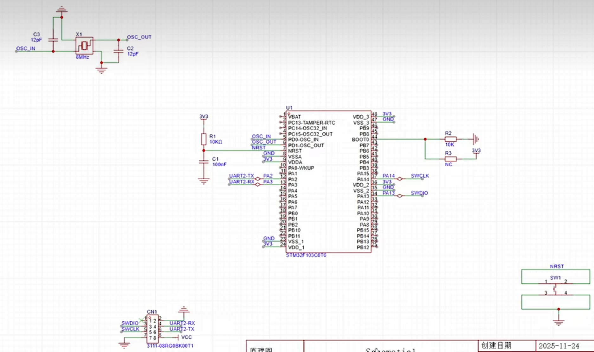
> IIC的通信协议的三根信号线：GND+SCL+SDA


#### 第三类：具体外设与接口

##### GPIO（通用输入输出端口）
STM32与外界交互的最基本接口，引脚可以配置为**输入**（读取外部信号）或**输出**（对外输出高低电平）。是你点灯、读按键的基础。

##### 串口 / UART / USART
- **串口**是**统称**，指串行通信接口。
- **UART**（通用异步收发器）：只支持**异步**串行通信。
- **USART**（通用同步异步收发器）：同时支持**同步和异步**串行通信，比UART更强大。

**关系**：USART是UART的升级版。STM32上通常用USART，但实际开发中大多只使用它的异步模式（当成UART用）。

##### DMA（直接存储器访问）
可以让数据**不经过CPU**，直接在**外设和内存之间**搬运数据。比如你要把串口收到的一大串数据存到内存里，用DMA的话CPU可以去做别的事，DMA自己就把活干完了。**核心价值：解放CPU**。

##### ADC（模数转换器）
将**模拟信号**（连续变化的电压）转换为**数字信号**（CPU能处理的数值）。比如读取光敏传感器、电位器的电压值。

##### DAC（数模转换器）
将**数字信号**转换为**模拟信号**（输出电压）。是ADC的逆过程，比如用来输出音频信号。

##### TIM（定时器）
STM32里的定时器功能非常强大，可以：计时、测量频率、**产生PWM波形**、配置编码器接口等。是你做呼吸灯、控制舵机的核心外设。

##### RTC（实时时钟）
在STM32内部完成**时分秒的计时**功能，可外接备用电池实现**掉电后继续走时**。

##### SDIO
SD卡接口，用于**读写SD卡**。

##### USB
生活中最常见的通信协议，STM32上通常作为**从设备**与电脑通信。

##### CAN（控制器局域网络）
主要用于**汽车领域**的通信协议，抗干扰能力强。

##### SPI（串行外设接口）
**同步串行通信**协议，使用4条线（时钟、数据出、数据入、片选），速度较快，适合连接高速设备。

##### I2C/IIC（两线式串行总线）
**同步串行通信**协议，只用2条线（时钟SCL、数据SDA），支持**多设备挂载**在同一总线上。MPU6050就是通过I2C与STM32通信的。

>起始位：当SCL是高电平时，SDA从高到低的跳变
停止位：当SCL是高电平时，SDA从低到高的跳变


### 三、概念关系


-----------------------------

## 第二部分 当世界有了光

-----------------------------

### 项目包1：

1 使用库函数点亮 STM32F103C8T6 最小系统板上的板载LED灯。
用按键实现LED的可控闪烁。

3 使用delay函数完成led以特定频率闪烁。

2 用GPIO实现流水灯效果。

4 使用光传感器实现“天亮灯灭，天暗灯亮”的功能。

### 项目包2：

使用PWM完成呼吸灯效果

---

#### 重点知识补充：

#### 1.GPIO

##### （1）可配置为8种输入输出模式：

带FT就是可以输入5V电压的，其他都是只能3.3V的输入，但是都是只能输出-或者3.3V的。


STM32是32位的寄存器，所有有32位，但是端口有16位，所以寄存器只有低16位对应有端口
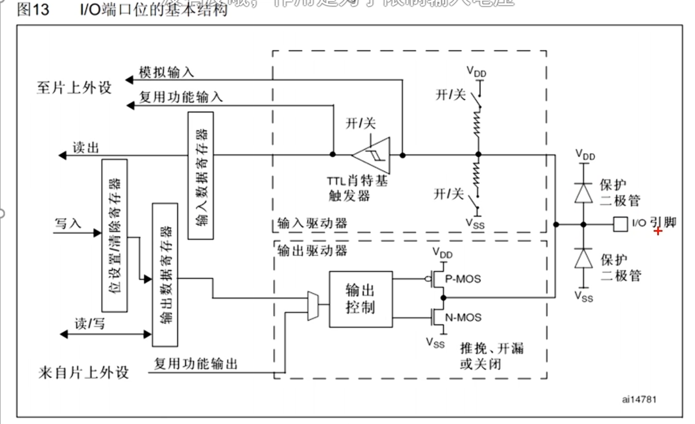

##### （2）具体：

1） GPIO_Mode_AIN 模拟输入；
2） GPIO_Mode_IN_FLOATING 浮空输入；
3） GPIO_Mode_IPD 下拉输入；
4） GPIO_Mode_IPU 上拉输入；
5） GPIO_Mode_Out_OD 开漏输出；
6） GPIO_Mode_Out_PP 推挽输出；
7） GPIO_Mode_AF_OD 复用开漏输出；
8） GPIO_Mode_AF_PP 复用推挽输出。

**【器件解释】**

1、保护二极管

1IO引脚上下两边两个二极管用于**防止引脚外部过高、过低的电压输入**。

2.TTL 肖特基触发器

信号经过触发器后，模拟信号转化为 0 和 1 的数字信号。
但是，当 GPIO 引脚作为 ADC 采集电压的输入通道时，用其**模拟输入功能**，此时信号不再经过触发器进行TTL电平转换。（可以理解为一个比较器，大于某个值是1，小于某个值是0）

查看《STM32中文参考手册V10》中的GPIO的表格时，会看到有“FT”一列，这代表着这个GPIO口时兼容3.3V和5V的；如果没有标注“FT”，就代表着不兼容5V。

##### （3）STM 32 GPIO 八种工作模式
1、模拟输入 GPIO_Mode_AIN
此模式可以检测外部输入的模拟电压，可以检测电压值，只要不高于Vcc即可。


2、浮空输入 GPIO_MODE_IN_FLOATIN
此模式最常用的是检测按键，可以接收高低电平。但容易被干扰。

3、下拉输入GPIO_Mode_IPD
此模式检测到电平默认为低，可以检测到由低到高的电平变化。

4、上拉输入GPIO_Mode_IPU
此模式检测到电平默认为高，可以检测到由高到低的电平变化。

5、开漏输出GPIO_Mode_Out_OD
开漏输出用于输出低电平，高电平靠外部上拉电阻电压决定，适用于快速切换电压的外部电路结构。
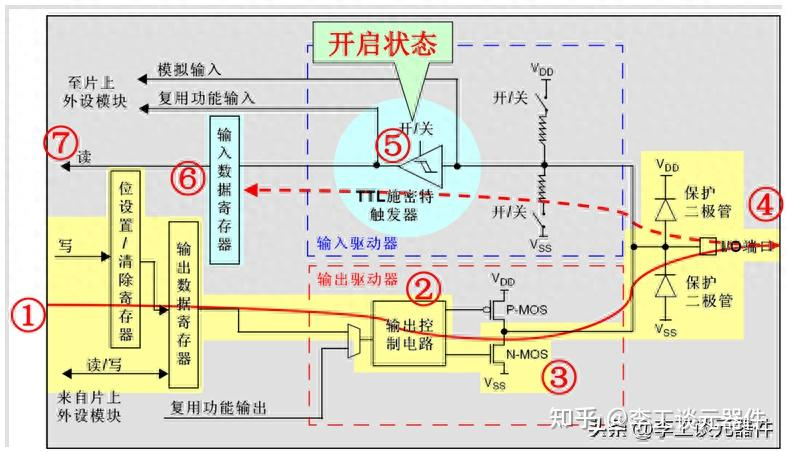

6、推挽输出GPIO_Mode_Out_PP
推挽输出用于输出高低电平，是最常用的模式。

7、复用开漏输出GPIO_Mode_AF_OD
复用 IIC 时候选择复用开漏输出，因为开漏输出可以“线与”。


8、复用推挽输出GPIO_Mode_AF_PP
其他复用比如 SPI 等可以选择复用推挽输出。


区别开漏输出和推挽输出：

**开漏输出的速度比推挽输出慢得多**，它真正厉害的地方是 **“电平转换”** 和 **“多设备共线（线与）”**。

###### 1. 推挽输出（GPIO_Mode_Out_PP）——强硬！！！
- **内部结构**：芯片内部有一个**P-MOS管（负责接高电平VDD）** 和一个**N-MOS管（负责接低电平VSS）**。
- **工作逻辑**：
  - 输出`1`（高电平）：P-MOS导通，N-MOS关闭，**直接短路到3.3V电源**，强力输出高电平。
  - 输出`0`（低电平）：P-MOS关闭，N-MOS导通，**直接短路到地（GND）**，强力输出低电平。
- **特点**：高低电平都有强驱动能力，**上升沿和下降沿都非常陡峭**，速度快。适合点灯、驱动舵机（PWM）、驱动蜂鸣器。
- **死穴**：**不允许两个推挽输出引脚直接连在一起！** 如果A输出高(3.3V)，B输出低(0V)，两个P-MOS和N-MOS同时导通，相当于**电源直接对地短路**，瞬间大电流会把芯片烧掉。

###### 2. 开漏输出（GPIO_Mode_Out_OD）
- **内部结构**：芯片内部**只有1个N-MOS管**，**没有P-MOS管**。上面是断开的（高阻态）。
- **工作逻辑**：
  - 输出`0`（低电平）：N-MOS导通，**强力拉到GND**。
  - 输出`1`（高电平）：N-MOS**完全关闭**，引脚处于**高阻态（Hi-Z）**，内部相当于把引脚“断开”了。**芯片自己绝对不输出高电平！**
- **高电平怎么来**：**必须在外部加一个上拉电阻（比如4.7KΩ或10KΩ）**，电阻的另一头接想用的电压（可以是3.3V，也可以是5V）。N-MOS关闭时，引脚就被电阻拉到了这个外部电压。


开漏输出依赖外部上拉电阻，而上升沿的电压是通过**电阻给寄生电容充电**建立的。电阻越大，上升越慢（几微秒）；电阻越小，上升快但功耗大。
- **推挽速度**：纳秒级（极快）。
- **开漏速度**：微秒级（较慢）。所以它**绝对不适合高速通信**（比如SPI的高速模式）。I2C标准模式只用400kHz，就是因为开漏跑不快。

###### 3. 既然开漏慢又麻烦，为什么还要用它？

**原因一：用来匹配不同电压的外部设备（电平转换）**
你的STM32是3.3V逻辑，但有些老式模块（或OLED）可能需要5V电平。开漏模式下，**STM32内部不输出高电平**，高电平完全由外部上拉电阻决定。
- 如果你想把3.3V单片机接到5V的I2C设备，只需在SDA和SCL上加**上拉电阻到5V**。STM32内部输出低电平时拉低到0V，输出高电平时“放手”让5V电阻拉上去。**完美实现电压匹配，还不伤芯片。**

**原因二：支持“线与”总线（多设备不打架）——这是I2C（MPU6050）必须用开漏的根本原因！**
I2C总线上挂了很多设备（MPU6050、OLED等）。如果主机和从机都用推挽输出：
- 主机想发1（拉高），从机想发0（拉低），瞬间电源短路，**芯片必烧**。
用了开漏模式：
- 主机发1时：N-MOS关闭（放手）。
- 从机发0时：N-MOS导通（拉低）。
- **结果**：因为主机关闭了，从机能轻松把总线拉低；反过来也一样。没有任何短路电流。

**结论**：I2C协议**强制要求**信号线（SCL、SDA）必须配置为**开漏输出**，配合外部上拉电阻。这就是为什么之后做MPU6050时，一定要在PB6/PB7上接两个4.7K电阻，并且在初始化GPIO时用 `GPIO_Mode_AF_OD`（复用开漏输出）。


###### 4. 一些常见的选择
| 场景 | 用哪个模式 | 为什么 |
| :--- | :--- | :--- |
| **点亮LED / 驱动舵机PWM** | **推挽输出** | 需要大电流驱动，速度要快，电平稳定。 |
| **按键输入检测** | 输入模式（上拉/下拉） | 输出模式是用于控制外部电路，读按键要配输入模式，别配错了。 |
| **MPU6050 的 I2C 通信** | **复用开漏输出** | I2C协议强制要求，必须配合外部上拉电阻，防止总线冲突烧芯片。 |
| **蓝牙 HC05 的 TX/RX** | **复用推挽输出（TX） / 浮空输入（RX）** | 串口是点对点通信（一对一），只有一个发一个收，不存在总线冲突，用推挽跑得快。 |

开漏输出用于输出低电平，高电平靠外部上拉电阻电压决定，适用于需要进行电平转换（匹配3.3V/5V）以及需要多设备共线（如I2C总线）的场景。


---

## 附加题【详见文件夹项目包3】

项目包3：
使用OLED显示你的学号、姓名，并且使用OLED显示一张图片

### 学习笔记：

### 1.OLED

#### 1）工作原理：OLED是一种利用有机材料发光的显示技术

（1）两个电极：一个是透明的阳极（通常用ITO材料），另一个是金属阴极。
（2）有机发光层：夹在两个电极之间，厚度仅有几十纳米。

>当给它通电时：
阴极会注入电子（带负电），阳极会注入空穴（可以理解为带正电的“空洞”）。
在电场作用下，电子和空穴会相向移动，在中间的有机发光层里相遇并结合。
它们结合时释放的能量会激发有机分子，分子从激动状态回到稳定状态时，就会以光的形式释放出多余的能量。
光的颜色由有机发光材料决定，而亮度则由电流大小控制。

（3）特点：OLED是自发光的

#### 2）OLED显示中文

（1）背景：内部只内置了英文字母和数字的字模（ASCII字符集），必须为要显示的中文提供“字模”（即每一个汉字在OLED上的点阵图案数据）

（2）方法：详见项目包3

-----------------

---

## 第三部分：项目一————舵机云台
---
---

### 挑战点一：使用PWM驱动舵机

#### 一、知识学习
##### 1.PWM——脉冲宽度调制
使用PWM呼吸灯来讲，就是快速多次的进行高低电平的交替，使得呈现一种中等亮度（一种等效的模拟量）

要求：具有惯性的系统（如：呼吸灯、电机）

参数：频率、占空比（高电平占一个周期内的时间长度）、分辨率（占空比变化的细腻程度）


2-4可以用于形成PWM的波形，2-3是输出一次性的信号，1和5-6都是用于暂停


这张图是一个**STM32定时器PWM生成的核心原理框图**，它把“时基”、“比较”和“输出路径”三个环节串在了一起。


###### 图片知识解释：
- 纵坐标代表 **计数器（CNT）** 的数值。
- 假设 **ARR（自动重装器）= 99**，那么 CNT 就会从 **0** 一直往上数到 **99**，然后溢出归零，重新再数（即 **0 → 30 → 99 → 0** 的三角波/锯齿波）。
- 图中的 **30** 代表写入 **CCR（捕获/比较器）** 的当前值。


这个 REF 信号就是一个**占空比 = 30 / (99+1) ≈ 30%** 的原始方波。
**CCR 的值决定了高电平持续多久（占空比）**，这就是 PWM 的核心。


>图里横坐标指向了 **REF → 极性选择 → 输出使能 → GPIO**，这代表原始信号 `REF` 要经过三次才能变成引脚上的实际电压：
>1. **REF（原始信号）**
>2. **极性选择**：可以选择“不反转”（高电平有效）或“反转”（低电平有效）。代码里写的 `TIM_OCPolarity_High` 就是告诉硬件不反转。
>3. **输出使能**：相当于一个总开关，只有开启（`TIM_OutputState_Enable`），信号才能往外送。
>4. **GPIO**：最终信号到达物理引脚（如 PA1），变成示波器上看到的实际波形。


**一句话总结**：**PSC 和 ARR 决定方波的“周期”（多宽），CCR 决定方波的“宽度”（高电平多长），REF 经过极性和使能后从 GPIO 输出。** 


**【注意重点！！！】**
这三个公式由定时器的 **硬件计数原理** 直接推导

###### 1.频率公式的来源
\[
F_{PWM} = \frac{CK\_PSC}{(PSC + 1) \times (ARR + 1)}
\]

###### 2. 占空比公式
\[
Duty = \frac{CCR}{ARR + 1} \times 100\%
\]


###### 3. 分辨率公式的来源
\[
Resolution = \frac{1}{ARR + 1}
\]

---
#### 二、思考题
##### 1. PWM由什么外设产生？核心参数有哪些及作用？
- **产生外设**：**定时器**（通用/高级定时器）的**输出比较通道**产生。本质是利用计数器（CNT）与比较寄存器（CCR）数值匹配时翻转电平。
- **三大核心参数**（由时基+比较器决定）：
  - **频率**（\( F_{PWM} \)）：由 **PSC** 和 **ARR** 共同决定，决定方波快慢（舵机要求 50Hz）。
  - **占空比**（Duty）：由 **CCR** 决定，决定高电平占比（控制舵机转角）。
  - **分辨率**（Resolution）：由 **ARR** 决定，决定 CCR 每变化 1 时占空比的最小步进（决定转动细腻度）。

##### 2. PWM输出对应的GPIO配置模式？与普通推挽核心区别？
- **配置模式**：**复用推挽输出**（`GPIO_Mode_AF_PP`）。
- **核心区别**：
  - **普通推挽输出**：引脚电平由 **CPU 写 ODR 寄存器** 控制，软件翻转速度慢且占用内核资源。
  - **复用推挽输出**：引脚电平由 **片上外设（定时器）直接硬件驱动**，断开 CPU 控制。定时器以纳秒级硬件速度自动翻转电平，且不占用 CPU 算力，这是产生高频稳定 PWM 的根本原因。

>需要**人为干预、随性变化、或简单开关”**（如点灯、按键扫描、软件模拟协议）→ 必须用普通推挽。
需要“**高频率、纳秒级准时、且靠硬件自动运行**”（如舵机 PWM、电机调速、串口通信、SPI 高速时钟）→ 必须用复用推挽。
##### 3. 舵机为何依靠PWM控制转角？高电平时长与角度对应关系？
- **控制原理**：舵机内部有**基准电路**和**电位器反馈**，它并不关心 PWM 的频率占比，而是靠检测 **高电平持续脉宽（μs）** 来决定输出轴转角。低电平期间是舵机内部处理器采样的“空闲期”。
- **对应关系**（标准 50Hz，周期 20ms）：
  - **0.5ms 高电平** → **0°**（极限左）
  - **1.5ms 高电平** → **90°**（中位）
  - **2.5ms 高电平** → **180°**（极限右）

##### 4. 舵机标准 50Hz PWM（20ms），72MHz 时钟，计算 PSC 和 ARR

| 题目参数 | 对应寄存器名 | 符号 |
| :--- | :--- | :--- |
| 72 MHz | 定时器时钟 | **CK_PSC** |
| 50 Hz | 目标PWM频率 | **F_PWM** |
| 20 ms | PWM周期 | **T_PWM** |
| 待求 | 预分频器 | **PSC** |
| 待求 | 自动重装载值 | **ARR** |

\[
F_{PWM} = \frac{CK\_PSC}{(PSC + 1) \times (ARR + 1)}
\]


>**第一步：定 ARR（为了分辨率高且 1 计数 = 1 μs）**
>- 周期 20 ms = 20000 μs，令计 20000 次溢出。
>- 所以：**ARR + 1 = 20000** → **ARR = 19999**

>**第二步：代入公式求 PSC**
PSC = 71


##### 5. 按键外部中断完整触发流程及全套配置步骤

核心知识点 EXTI（外部中断/事件控制器） 和 NVIC（嵌套向量中断控制器）

- **触发流程**：**按键电平变化** → **EXTI（外部中断线）** 检测到边沿跳变 → **NVIC（嵌套向量中断控制器）** 根据优先级响应 → **CPU 跳转执行中断服务函数（ISR）**。

- 全套配置步骤：
  1. **配置 GPIO**：开启 GPIO 时钟，将按键引脚设为 **输入模式**（浮空/上拉，取决于按键电路，若按键接 GND 则开启上拉输入）。
  2. **配置 AFIO（复用功能IO）**：开启 AFIO 时钟，调用 `GPIO_EXTILineConfig()` 将该 GPIO 引脚映射到对应的 EXTI 线（如 PA0 映射到 EXTI0）。
  3. **配置 EXTI**：设置 EXTI 线的**触发边沿**（上升沿/下降沿/双边沿），并使能 EXTI 中断（`EXTI_Init()`）。
  4. **配置 NVIC**：设置该中断通道的**抢占优先级和响应优先级**，并使能 NVIC 响应（`NVIC_Init()`）。
  5. **编写中断服务函数**：在对应的中断向量入口（如 `EXTI0_IRQHandler`）中，**务必先清除中断标志位（`EXTI_ClearITPendingBit()`）**，再执行消抖和按键逻辑（避免重复触发）。


---
---

### 挑战点二：使用蓝牙模块进行信息的发送和接收

#### 一、知识学习

#### 1.通信接口

目的：将一个设备的数据传送到另一个设备，扩展硬件系统
通信协议：指定协议的规则，通信双方按照协议规则进行数据收发
    >比如：USART串口 的简单的引脚--> TX数据发送脚 RX数据接受脚
    12C SP1 CAN USB
    
#### 2.串口通信

介绍：串口是最简单的通信接口，一般是点对点两者间互相通信
优势：单片机与电脑可以通信

硬件电路：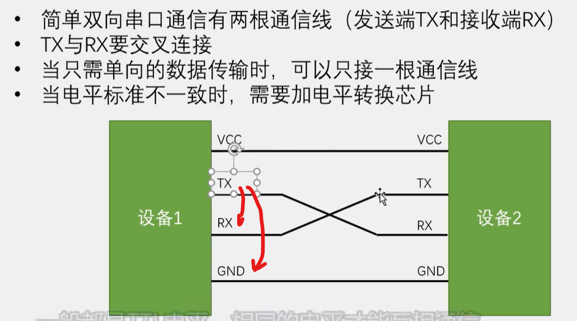
电平标准：数据1和0的表达方式，是传输线缆中人为规定的电压与数据的对应关系，最简单常用的TTL电平

串口参数与时序：
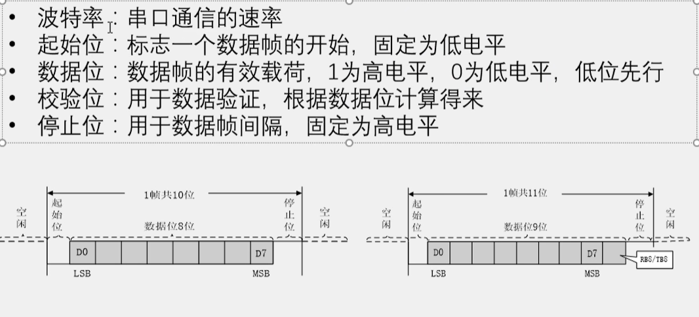
>波特率、比特率
波特率标志了每隔多久发送一位的数据（数据位一共8位）——波特率越大，时间越短
起始位和停止位：固定0和1，用于数据开始和结束的标志
数据位：注意低位先行 比如：OF--转换二进制00001111---输入11110000
校验位：（以有检验位的时候的奇校验为例）保证数据位连同校验位总体1的个数为奇数--意义，可以在接受的时候发现是否有某位在传输过程中错了——但是使用的不多

#### 3.USART外设
USART通用同步收发器
UART 通用异步收发器

USART通用同步收发器功能：根据数据寄存器的一个字节数据自动生成数据帧时序，从TX引脚发送出去，也可以自动接收RX引脚的数据帧时序，拼接为一个字节数据，存放在数据寄存器里

>常用的参数设定：
波特率 9600 115200
数据位：8位
停止位：1位
可选校验位：无校验

>其他功能：硬件流控制、DMA、智能卡、IrDA、LIN...
本芯片的资源：USART1/2/3 (APB1/2/2)

##### （1）USART框图
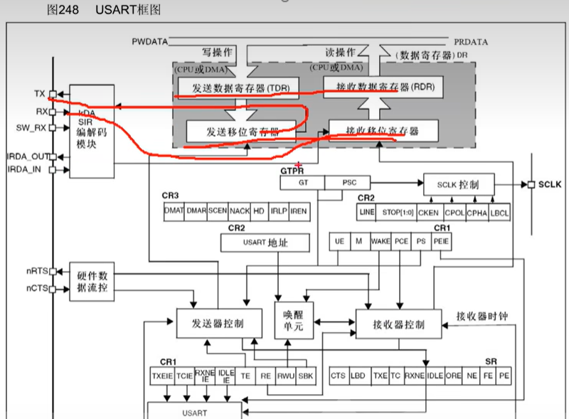
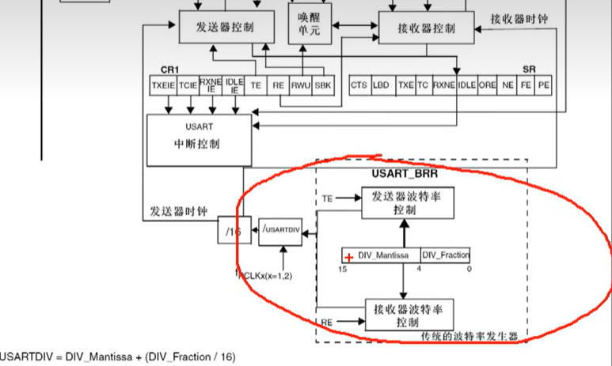
注意：TDR和RDR本质是一个寄存器DR
在每一位的中间采样才是最好的，输入数据面临这个问题

##### （2）输入
起始位侦测：（处理噪声、采样位对齐）
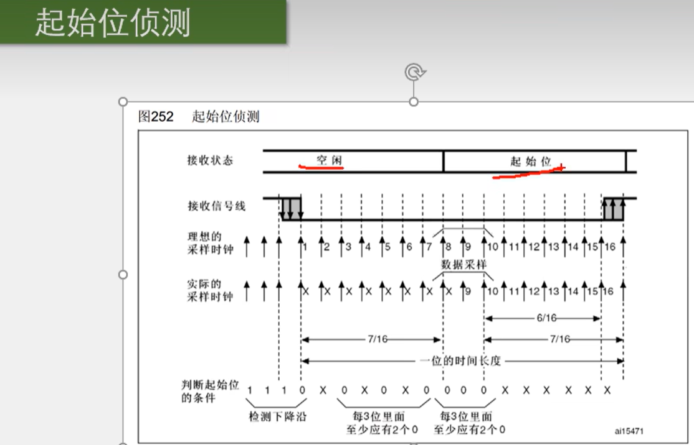
数据采样：--16位的采样
波特率发生器：
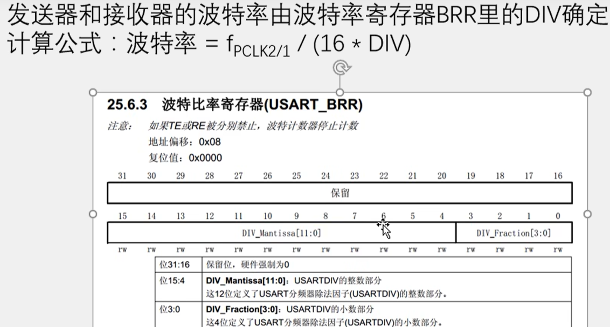

---
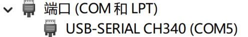


#### 4.HC05蓝牙板块

（1）介绍：蓝牙模块可以将有线串口数据流转换为无线蓝牙数据流，实现无线串口功能

蓝牙类别：经典蓝牙（SPP，3.0及以下）--速度更快
         低功效蓝牙（BLE 4.0及以上）--功耗低、新功能多
         双模蓝牙（SPP+BLE）--兼容性更强
         
主从类别：单从机
         主从一体—-可以实现两个蓝牙的连接

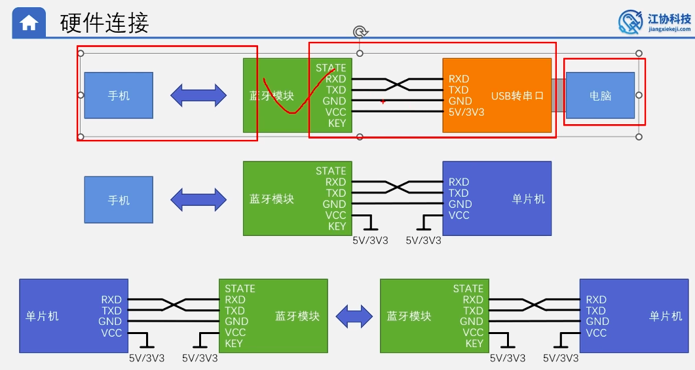

（2）AT模式
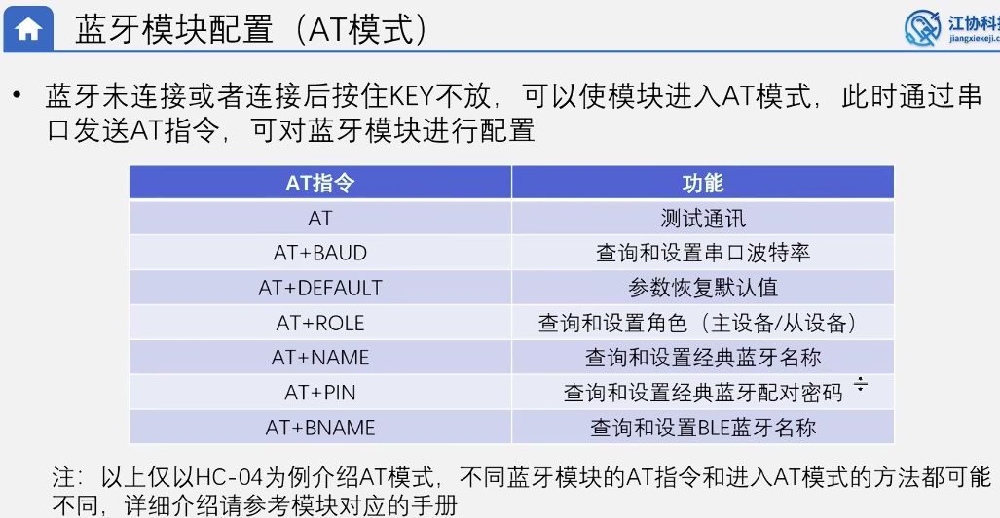
注意：不是所有都是一样的! 

---

#### 二、功能实现
##### 1.引脚配置说明图
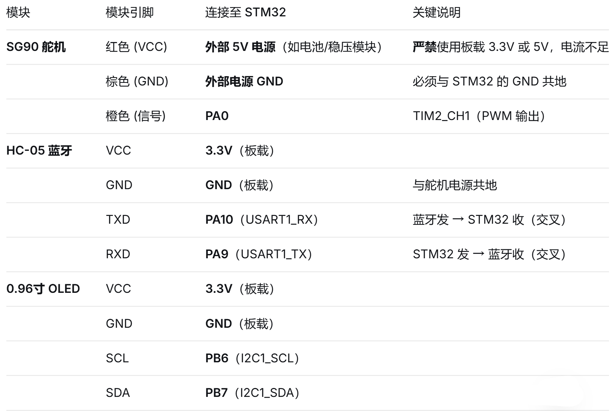

##### 2.挑战点功能演示视频（见附件）

##### 3.Keil5完整项目工程（见附件）

##### 4.实现步骤

| 阶段 | 核心任务 | 关键执行细节 |
| :--- | :--- | :--- |
| **1. 硬件连接** | 搭建物理电路 | • 舵机信号线→**PA0**（VCC接**外部5V**，GND共地）<br>• HC-05的TX→**PA10**（RX），RX→**PA9**（TX）<br>• OLED的SCL→PB6，SDA→PB7 |
| **2. 工程配置** | 初始化STM32外设 | • 定时器TIM2：PSC=**720-1**，ARR=**2000-1**（得50Hz）<br>• 串口USART1：波特率**9600**，8N1格式<br>• 开启TIM2通道1的PWM输出（PA0） |
| **3. 逻辑编程** | 写主循环代码 | • 串口中断/查询接收字节，存入缓冲区<br>• 遇换行符`\n`时截断字符串<br>• 用`atoi()`解析角度，公式映射：<br> `CCR = 50 + (angle × 200) / 180`<br>• 调用`TIM_SetCompare1`输出PWM，刷新OLED |
| **4. 有线调试** | 验证底层硬件 | • 先烧录固定角度代码（如`SetCompare1(150)`），确认舵机能转<br>• 用USB转TTL模块接PA9/PA10，电脑发`90\n`，看舵机是否反应 |
| **5. 无线联调** | 接入蓝牙遥控 | • 配对HC-05<br>• 打开蓝牙串口APP发送数字指令<br>• 观察OLED反馈与舵机跟随情况 |


##### 5.个人理解与感悟

1. 嵌入式调试的本质是“分而治之”
舵机不动时，我先测固定PWM（排除代码），再测电源（排除供电），最后查引脚——发现接错到PA1。**模块化验证**比盯着整段代码找bug高效。

2. 串口通信规矩
蓝牙发来的是字节流，没有换行符`\n`做“结束标记”，单片机就不知道指令何时收完。本次用`\n`截断，既防止了缓冲区溢出，又确保了`atoi`解析的完整性——**通信协议中，结束符和超时处理比数据本身更重要**。

3. 映射公式舵机认的是**1.5ms高电平**（90°），而非简单的“占空比50%”。理解`CCR = 时间 / (周期/ARR)`的物理意义后，无论换什么舵机，都能自己推导出映射系数，而不是照搬别人的“5~13”。


---

#### 三、思考题回答

##### 问题一：HC05与STM32采用UART异步串口通信，对比GPIO直连，为何适合中远距离传输？UART数据收发引脚有哪些？

- **适合中远距离的原因**：  
  - UART是串行通信，数据在单根线上按位传输，所需线缆少（仅TX/RX两根），线间串扰小，信号衰减可控；而GPIO直连若传输多bit数据需多根并行线，线间干扰大，传输距离受限。  
  - HC-05本身是蓝牙模块，支持约10米无线传输，配合UART有线连接，实现“无线+串行”组合，进一步扩展了通信距离。  
- **引脚**：  
  - **TX**（发送端）  
  - **RX**（接收端）  
  - 连接时需**交叉**：HC-05的TXD接STM32的RX，HC-05的RXD接STM32的TX。


##### 问题二：首次使用HC05，如何通过AT指令修改波特率、设备名称？硬件接线注意事项？

- **进入AT模式**：按住模块上的按键再通电（或KEY引脚接高电平），指示灯变为慢闪（约2秒1次），此时串口波特率默认为38400。  
- **修改指令**：  
  - 改名称：`AT+NAME=新名称`（如 `AT+NAME=MyServo`）  
  - 改波特率：`AT+UART=波特率,停止位,校验位`，例如 `AT+UART=9600,0,0`（0表示1位停止位、无校验）。  


##### 问题三：蓝牙接收数据时，UART接收中断对比主循环轮询有哪些效率优势？中断服务函数如何缓存、解析接收数据？


- **中断vs轮询优势**：  
  - **CPU占用**：轮询方式在115200波特率下持续接收时CPU占用高达95%以上，而中断方式仅约15%~25%。  
  - **实时性**：中断由硬件触发，微秒级响应，不会因主循环执行其他任务而漏收数据；轮询若间隔过长易丢帧。  
  - **多任务兼容**：中断方式不阻塞主循环，可同时处理屏幕刷新、电机控制等任务。  
- **缓存与解析方法**：  
  - **中断服务函数**中只做一件事：将接收到的字节存入**环形缓冲区**，避免因数据处理耗时导致后续字节丢失。
  - **主循环**中从缓冲区读取字节，并进行协议解析（如判断帧头、提取角度值），实现“接收”与“处理”分离。

##### 问题四：结合挑战点一PWM代码，蓝牙接收角度指令后如何复用原有舵机驱动逻辑？角度数值如何换算为PWM有效占空比？

- **复用逻辑**：将原有PWM驱动封装为函数 `Servo_SetAngle(uint8_t angle)`。蓝牙接收部分只需从环形缓冲区提取角度值，然后直接调用该函数。  
- **角度→PWM换算**（以我们项目中用到的SG90舵机、20ms周期为例）：  
  - 0°对应脉宽0.5ms，90°对应1.5ms，180°对应2.5ms，线性关系：  
    `脉宽(ms) = 0.5 + (角度/180) × 2.0`  
  - 假设定时器时钟1MHz（每计数1次=1µs），则脉宽对应的计数值为：  
    `计数值 = 500 + (角度 × 2000) / 180`（0.5ms=500计数，2.5ms=2500计数）  
  - 将该计数值赋给定时器的比较寄存器（CCR），即可产生对应占空比的PWM波，驱动舵机转到指定角度。
   
   

---

---

### 挑战点三：使用MPU6050读取姿态

#### 一、知识学习

#### 1.I2C协议
I2C总线是Philips公司在八十年代初推出的一种串行、半双工的总线，主要用于近距离、低速的芯片之间的通信
I2C总线有两根双向的信号线，一根数据线SDA用于收发数据，一根时钟线SCL用于通信双方时钟的同步
I2C总线硬件结构简单，简化了PCB布线，降低了系统成本，提高了系统可靠性，因此在各个领域得到了广泛应用。

I2C总线是一种多主机总线，连接在 I2C总线上的器件分为主机和从机。


#### 2.MPU6050

介绍：6轴姿态传感器（X\Y\Z轴的加速度、角速度）————通过数据融合可进一步得到姿态角
     3轴加速度计（测量三个轴的加速度，实质是三个弹簧测力计，静态稳定，动态不稳定） + 3轴陀螺仪传感器（简称Gyr，测量三个轴的角速度，动态稳定，静态不稳定）

参数：
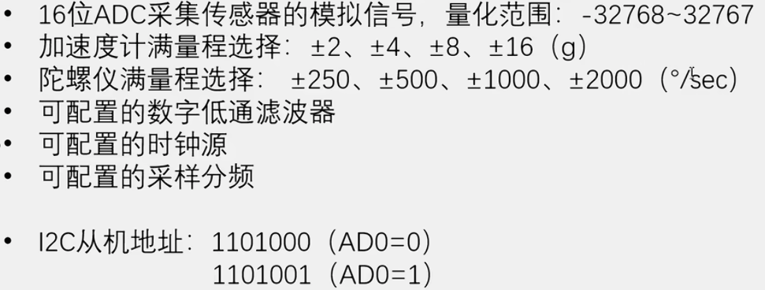

融入读写位后的从机地址是左移一位后的地址0XD0

寄存器：
1.采样分频寄存器（分频越小，AD转换越快，数据刷新越快）
2.配置寄存器（外部同步+低通滤波器）
3.陀螺仪位置寄存器（自测响应、满量程选择）
4.加速度计配置寄存器
5.加速度计数据寄存器
6.电源管理寄存器
7.ID号（I2C地址）

#### 3.软件I2C读写MPU6050

软件I2C是需要GPIO口，不需要库函数

配置为开漏输出（可以输入、可以输出）
可以统一替换端口号来便于后续修改端口名称的需求
可以使用有参宏变量来define（但是迁移不是很好，所以直接使用函数更方便）

SCL：PB10（低电平写入数据，高电平读出数据）（SCL高电平时SDA下降为起始，SDA上升为终止）
SDA：PB11
可以分别设置write和read的函数

点名时序

改名（AD0一个引脚，有两个名字，避免从机地址的重复）
#### 4.I2C通信外设
#### 5.硬件I2C读写MPU6050
---
#### 二、项目实践

##### 1.引脚配置说明图

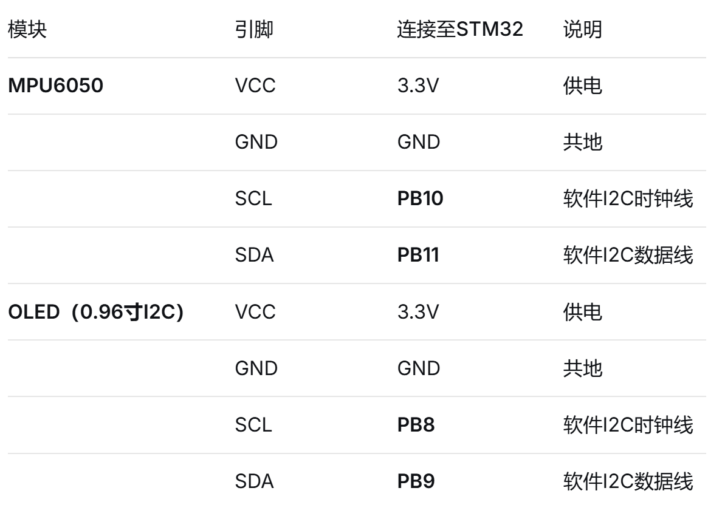

##### 2.实现步骤

**Step 1 - 搭建I2C通信层**
- 用GPIO模拟SCL/SDA时序：起始、停止、发送字节、接收字节、应答/非应答
- 关键操作：拉高/拉低电平后需插入微秒级延时（`Delay_us(10)`），保证时序稳定

**Step 2 - 配置MPU6050寄存器**
```
PWR_MGMT_1   → 0x01   // 唤醒芯片，选X轴陀螺仪作时钟源
SMPLRT_DIV   → 0x09   // 采样率 = 1000/(9+1) = 100Hz
CONFIG       → 0x02   // DLPF=92Hz，硬件滤除高频振动
GYRO_CONFIG  → 0x18   // ±2000°/s 量程
ACCEL_CONFIG → 0x18   // ±16g 量程
```

**Step 3 - 读取原始数据并换算**
- 从 `0x3B` 开始连续读取14字节（加速度6B + 温度2B + 陀螺仪6B）
- 高字节左移8位 | 低字节 → 16位有符号数
- 除以对应灵敏度：±16g → 2048 LSB/g

**Step 4 - 计算姿态角**
```
Pitch = atan2(-AX_g, sqrt(AY_g² + AZ_g²)) × 180/π
Roll  = atan2(AY_g, AZ_g) × 180/π
```

**Step 5 - 一阶滞后滤波**
```
filtered = α × raw + (1-α) × last_filtered
```
`α=0.4` 时，兼顾响应速度与平滑度。


---

#### 三、思考题

**1. I2C对比UART的多设备优势？AD0如何区分地址？**
- **优势**：I2C是**总线型**，两根线（SCL/SDA）可挂载**127个**从机，通过**设备地址**寻址；UART是**点对点**，无法在总线上挂多个从机（除非额外协议）。本项目MPU6050和OLED共享I2C总线就是利用此特性。
- **AD0作用**：MPU6050的7位地址固定为`0b110100X`，**X由AD0引脚电平决定**。AD0接GND→地址`0x68`，接VCC→`0x69`。因此**一根总线最多挂2个**。
- **为何用软件I2C**：硬件I2C引脚固定（如PB6/PB7），极易与SPI/UART冲突。本项目用软件I2C将MPU放在**PB10/PB11**。

**2. 加速度原始数据含义？Roll/Pitch公式如何推导？**
- **物理含义**：静止时，加速度计测量的是**重力加速度在该轴的分量**（单位g），而非“运动加速度”。例如水平放置时，Z轴读数为1g，X/Y轴为0。
- **推导思路**：重力矢量在载体坐标系中投影为 `(AX, AY, AZ)`。利用三角关系，俯仰角是X轴与水平面的夹角，横滚角是Y轴绕X轴的旋转角。
- **公式**：
  ```
  Pitch = atan2(-AX, sqrt(AY² + AZ²)) × 180/π
  Roll  = atan2(AY, AZ) × 180/π
  ```
  （负号取决于坐标系定义，本项目实测需加负号使方向对应舵机正转）

**3. 运动时角度误差大的原因？一阶滤波原理及α影响？**
- **根本原因**：运动加速度（如挥动、震动）混入重力分量中，破坏了“重力投影”假设。此时`AX/AY/AZ`包含非重力项，导致角度剧烈跳变。
- **滤波原理**：本质是**低通滤波器**，公式 `filtered = α*raw + (1-α)*last` 将当前测量值与历史值加权平均，**高频噪声被衰减**，低频姿态得以保留。
- **α影响**：本项目实测 **α=0.4** 效果最佳。
  - `α`过大（如>0.8）：响应快但抖动明显（噪声抑制差）。
  - `α`过小（如<0.2）：平滑但滞后严重（快速倾斜时舵机跟不上）。

**4. 完整读取流程及数据校验方法？**
- **寄存器流程**：写从机地址+W→写目标寄存器地址（如`0x3B`）→**重复起始**→写地址+R→连续读取N字节→发送非应答终止。
- **读取加速度步骤**：从`0x3B`开始连续读6个字节（三轴各16位），高字节左移8位|低字节得到`int16`原始值。
- **数据校验**（本项目实战经验）：
  - **硬校验**：读`WHO_AM_I(0x75)`，期待固定值**0x68**，确认通信链路通。
  - **软校验**：检查三轴原始值**是否全为0或全为-1**。若出现此情况，代表I2C总线挂死或MPU未响应，本项目代码中通过**连续5次错误自动复位MPU**，防止系统卡死。

**5. 浮点数角度转OLED字符串（不依赖`printf`）？**
    整数拆分法即可
    不过需要注意处理负数时小数部分取绝对值，防止出现`-90.-5`的乱码。

---
---

### 挑战点四：整合

#### 一、项目实践：双模式舵机云台控制

**Step 1 - 封装舵机控制接口**
- 定时器配置：PSC=72-1，ARR=20000-1 → 50Hz
- 映射公式：`CCR = Angle/180 × 2000 + 500`（0°→500，180°→2500）
- 加入**死区**：角度变化小于0.3°时忽略，滤除微小抖动
  
**Step 2 - 建立双模式调度**
```
蓝牙模式（Work_Mode=0）：Target_Angle = Bluetooth_TargetAngle
MPU模式（Work_Mode=1）：Target_Angle = filtered_Pitch + 90.0°
```
**Step 3 - 按键切换**
- PB1按键检测（阻塞式+消抖），按下后 `Work_Mode` 取反
- 注意：`Key_GetNum()` 有等待松手的循环，要放在主循环内且不能影响其它任务

**Step 4 - 串口中断内拼装字符串（关键！）**
- 在中断中逐字节接收，遇到 `\n` 时封包成完整字符串
- 主循环只检测 `RxComplete` 标志并执行 `atoi` 解析
- **避免主循环延时导致丢字节**

**Step 5 - MPU自动复位机制**
- 检测到三轴全0或全-1时，计数器累加
- 连续失败5次 → 自动调用 `MPU6050_Init()` 复位

---

#### 二、硬件引脚规划文档（【附件1】）

（注：本段落比较长，所以放在本文最后了）
---

----

---

# 附加题
---

---

## （一）附加题一：DMA传输优化系统效率

#### 一、知识学习

#### 1.DMA 直接存储器存取

##### （1）简介
DMA可以提供外设和存储器或者存储器和存储器之间的高速数据传输，无需CPU干预
（存储器--存储器  ***软件触发***
外设--存储器  ***硬件触发***）

含有12个独立可配置的通道 DAM1（7） DAM2（5）
但是这一芯片只有DMA1的七个通道

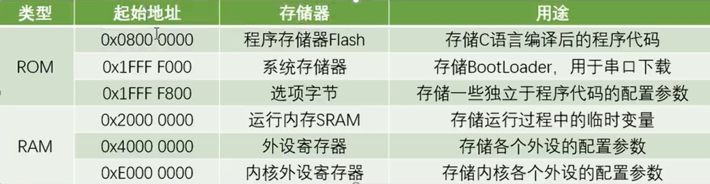

##### （2）DMA基本结构

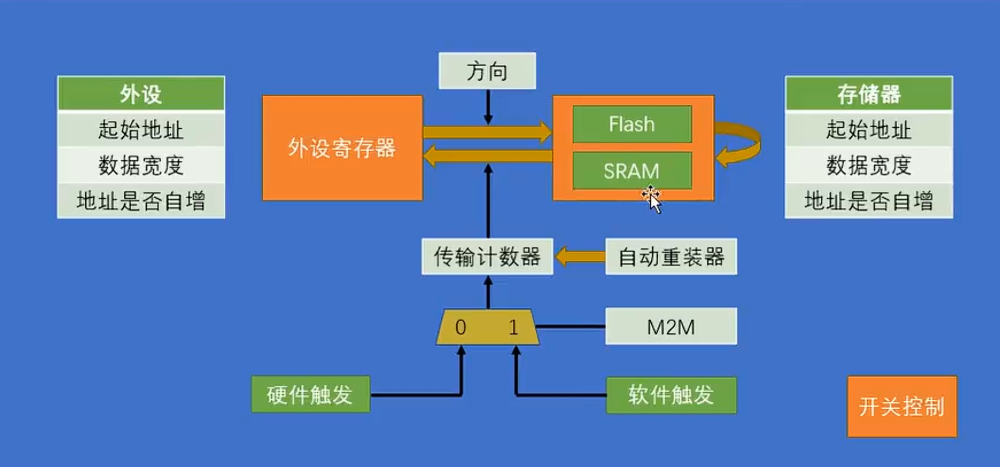

解释：
Flash只读
数据宽度，可以选择字节 半字uint16 一字

每个通道都可以使用软件触发，但是只有特定的硬件触发

##### （3）数据转运+DMA

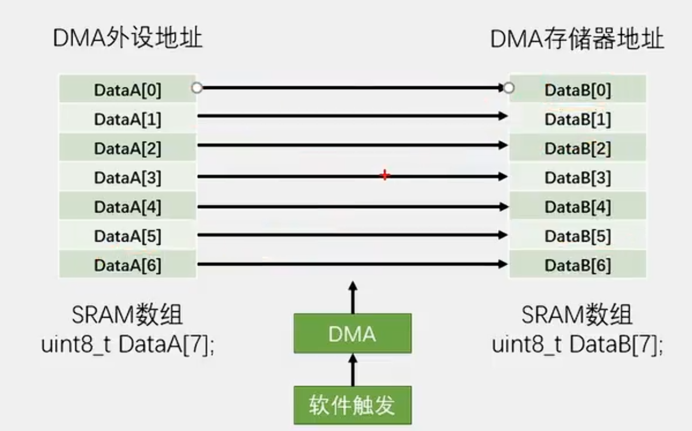

复制转运

##### （4）ADC扫描模式+DMA
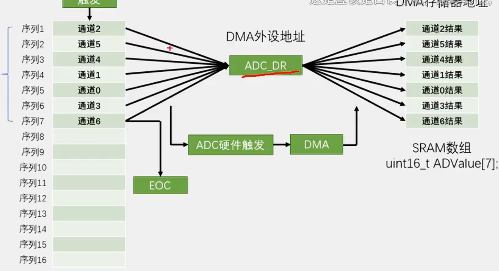

ADC扫描模式，基本上必须使用DMA，要不然功能有很大的限制


#### 二、思考题

##### 1. 不使用DMA的性能损耗 vs DMA如何实现CPU零干预

**不使用DMA时的性能损耗：**

在传统轮询或中断方式下，CPU需要亲自执行每一次数据搬运：
不断检查外设状态寄存器，等待数据就绪后读取/写入。这种方式CPU被完全占用，无法处理其他任务，效率极低。

以本项目为例，如果每1秒通过I2C读取MPU6050的6个寄存器（加速度X/Y/Z各2字节），再通过UART发送到上位机，即使频率不高，但每次中断的上下文切换开销累积起来仍会影响系统实时性。

**DMA实现CPU零干预的原理：**

DMA控制器是独立于CPU的硬件模块，拥有自己的总线控制权。配置完成后，DMA可以：
1. 监听外设的DMA请求信号
2. 当外设准备好数据（如I2C接收完成、UART发送寄存器空）时，DMA自动响应
3. DMA直接从源地址读取数据，写入目标地址，整个过程无需CPU介入

DMA方式是“点到点”的数据转移，而不使用DMA时CPU需要作为“中转站”，显然DMA效率更高。


##### 2. 两路DMA通道的配置分工


| 配置项 | 第一路DMA（MPU6050→内存） | 第二路DMA（内存→USART） |
|--------|--------------------------|------------------------|
| **传输方向** | 外设到内存（Peripheral to Memory） | 内存到外设（Memory to Peripheral） |
| **源地址** | I2C数据寄存器地址（如`&I2C1->DR`） | 内存缓冲区地址（如`mpu6050_buffer`） |
| **目标地址** | 内存缓冲区地址（如`mpu6050_buffer`） | USART发送数据寄存器地址（如`&USART1->DR`） |
| **外设地址增量** | 禁止（每次从同一I2C_DR读取） | 禁止（每次写入同一USART_DR） |
| **内存地址增量** | 使能（依次存入数组不同位置） | 使能（依次从数组不同位置读取） |
| **数据宽度** | 字节（Byte），MPU6050寄存器为8位 | 字节（Byte），UART发送8位数据 |
| **传输模式** | 单次或循环 | 单次 |


#####  3. DMA传输完成通知机制

DMA传输完成后，通过**传输完成中断** 通知CPU。

**需要开启的中断类型：**
- **TCIE（Transfer Complete Interrupt Enable）**：传输完成中断使能位
- 可选：HTIE（Half Transfer Interrupt Enable）半传输完成中断

**中断处理流程：**
1. 配置DMA时使能传输完成中断（`DMA_IT_TC`）
2. 传输完成后硬件自动触发中断
3. 在中断服务函数中：
   - 清除中断标志位
   - 执行数据校验（如检查校验和）
   - 准备下一轮采集（如重置缓冲区指针、启动下一次传输）
   - 或通过信号量/标志位通知主循环处理数据

**HAL库中的回调机制**：
使用HAL库时，传输完成会调用`XferCpltCallback`回调函数，用户可在其中编写后续处理逻辑。

##### 4. 定时器实现1s定时配置流程

**完整配置步骤：**

**Step 1：时钟源选择**
- 选择定时器的时钟源（通常为APB1或APB2总线时钟）
- STM32F103的TIM2-TIM7挂载在APB1上（72MHz），TIM1/TIM8挂载在APB2上（72MHz）

**Step 2：PSC预分频器和ARR自动重装载值计算**
- 目标频率：1Hz（周期1s）
- 定时器时钟：72MHz
- 公式：`定时频率 = 定时器时钟 / (PSC + 1) / (ARR + 1)`

选择PSC=7199，ARR=9999：
```
定时频率 = 72,000,000 / 7200 / 10000 = 1Hz
```

**Step 3：配置定时器模式**
- 设置为向上计数模式
- 自动重装载（Auto-reload preload enable）

**Step 4：使能更新中断**
- 使能TIM_IT_Update中断
- 配置NVIC优先级

**Step 5：启动定时器**
- 调用`HAL_TIM_Base_Start_IT(&htim)`启动定时器及其中断

#####  5. 完整数据流时序图

```
时间轴 ──────────────────────────────────────────────────────────────────►

 定时器          DMA(读)          I2C            DMA(写)          UART
 (TIM2)      (MPU6050→MEM)    (MPU6050)      (MEM→USART)      (上位机)
    │              │              │               │               │
    │  1s定时到达  │              │               │               │
    ├──────────────►              │               │               │
    │              │ 发起DMA请求  │               │               │
    │              ├─────────────►│               │               │
    │              │              │ 读取加速度数据 │               │
    │              │              │ (I2C通信)     │               │
    │              │              │◄──────────────┤               │
    │              │ 数据写入内存  │               │               │
    │              │◄─────────────┤               │               │
    │              │              │               │               │
    │              │  传输完成中断 │               │               │
    │              ├──────────────┤               │               │
    │              │ (TC中断)     │               │               │
    │              │              │   触发第二路DMA│               │
    │              │              │               │               │
    │              │              │               │ 从内存读数据  │
    │              │              │               │◄──────────────┤
    │              │              │               │               │
    │              │              │               │ 写入USART_DR  │
    │              │              │               ├──────────────►│
    │              │              │               │               │ 串口发送
    │              │              │               │               │ (无线传输)
    │              │              │               │               │
    │  等待下一次  │              │               │               │
    │  1s定时触发  │              │               │               │
    └──────────────┴──────────────┴───────────────┴───────────────┘

```

#### 三、项目实现

#####  3.1 硬件引脚规划

| 模块 | 引脚 | 功能 | 备注 |
|------|------|------|------|
| MPU6050 | PB6 (SCL) / PB7 (SDA) | I2C1 | 需外部上拉电阻 |
| HC05蓝牙 | PA9 (TX) / PA10 (RX) | USART1 | 与STM32交叉连接（TX→RX, RX→TX） |
| 舵机PWM | PA0 / PA1 / PA2 | TIM2_CH1/CH2/CH3 | PWM输出控制舵机 |
| 按键 | PE0 / PE1 | EXTI | 模式切换 |
| OLED | PB8 (SCL) / PB9 (SDA) | I2C1 | 与MPU6050共用I2C总线 |

**资源冲突检查：**
- I2C1同时连接MPU6050和OLED，通过不同设备地址区分（MPU6050地址0x68/0x69，OLED地址0x3C/0x3D）
- TIM2同时用于PWM和1s定时，建议使用不同通道：PWM用TIM2_CH1/CH2/CH3，1s定时用TIM2的更新事件（不与PWM通道冲突）


---
##### 3.2 个人理解与感悟：遇到的关键问题与处理方式

>问题1：软件 I2C 与 DMA 不兼容
**现象**：原挑战三用软件 I2C（GPIO 模拟），无法用 DMA。
**根因**：DMA 只能搬运"地址固定、有硬件事件源"的 DR 寄存器。软件 I2C 用 GPIO，没有 DR 寄存器，DMA 无从挂接。
**处理**：切换到硬件 I2C2（PB10/PB11 复用开漏），新增 [MPU6050_HW_I2C.c]

>问题2：DMA 通道映射认知错误（我个人失误）
**现象**：一度怀疑 I2C2_RX 与 USART1_TX 共用 DMA1_Channel4 需要改接线。
**根因**：被网络搜索中 STM32F767 的 DMA 表格误导（F7 用 Stream/Channel 双层映射）。
**处理**：核对 ST 官方应用笔记 AN2548 Table 1，确认 I2C2_RX→Ch5、USART1_TX→Ch4，两路通道不冲突。

>问题3：DMA 读到的全是 0x3B
**现象**：`R:3B3B3B3B3B3B`，全是寄存器地址。
**根因**：提前使能 `I2C_DMACmd` 会让 CPU 写 DR 的 0x3B（寄存器地址）被 DMA 误当作 RXNE 触发搬走。
**处理**：CPU 先读第一字节到 buf[0]，再使能 DMA 搬剩余 5 字节，避免 TXE 误触发。

>问题4：数据固定不变（核心 bug）
**现象**：`R:0040FFEA0885` 重复输出，翻板子不变。
**根因**：F103 I2C errata——DMA + LAST 模式下 STOP 信号丢失，BUSY 永久保持，I2C2 卡在主接收模式，后续读取实际没和 MPU6050 通信。
**处理**：① DMA TC 中断里手动 `I2C_GenerateSTOP`；② 下次启动前检测 BUSY 卡死则软件复位 I2C2 + 重新初始化。

---
----

## （二）附加题二：无线控制云台

### 一、知识学习

**1. 无线串口通信（HC-05 蓝牙透传）**  
采用主从配对模式，控制端 HC-05 设为主机，执行端设为从机，统一波特率 9600，8N1。上电后自动建立 SPP 连接，透传串口数据。
控制端每 20ms（50Hz）通过 USART1 发送一帧格式化角度字符串 `R:+xxx P:+xxx Y:+xxx\n`；
执行端 USART1 接收，利用 **DMA1 通道 5** 配合 **IDLE 空闲中断** 实现变长包的非 CPU 搬运，接收完成后置标志，主循环解析数据。  
**2. 姿态解算（三轴欧拉角）**  
- **原始数据**：MPU6050 输出三轴加速度（±2g）和三轴陀螺仪（±250°/s），通过软件 I2C（GPIO 模拟）读取。  
- **加速度→俯仰/横滚**：利用重力分量，`Pitch = atan2(-ax, sqrt(ay²+az²))`，`Roll = atan2(ay, az)`（单位转度）。  
- **陀螺仪积分**：角速度 × 采样周期（20ms）得到角度增量，累加得到预测角度。  
- **卡尔曼滤波融合**：对 Roll 和 Pitch 分别建立一维卡尔曼滤波器，状态量为角度，控制量为陀螺仪角速度。  
  预测：`X(k|k-1) = X(k-1) + gyro * dt`，`P = P + Q`  
  更新：`K = P / (P + R)`，`X = X + K * (accel_angle - X)`，`P = (1-K)*P`  
  Q（过程噪声）和 R（测量噪声）经调试取 0.001 和 0.5，有效抑制加速度计高频噪声，同时补偿陀螺仪零漂。  
- **Yaw 航向角**：因无磁力计，采用陀螺仪 Z 轴积分，开机静止 2 秒采集 100 帧求均值作为零偏，积分时扣除零偏，并限制在 ±180° 内。  
  
**3. 舵机联动原理**  
舵机采用 PWM 控制，周期 20ms（50Hz），脉宽 0.5~2.5ms 对应 0~180°。执行端收到角度后：  
- **上层舵机** = Pitch（俯仰角，限幅 0~180°）  
- **下层舵机** = Roll + 0.2×Yaw（横滚角叠加航向补偿，使云台在水平旋转时下层舵机同步偏转，避免视觉跟随滞后），最终限幅 0~180°。  
舵机每次更新前与当前角度比较，若差值小于 0.5° 则忽略（死区防抖）。

---

### 二、项目实践

##### 1. 硬件引脚说明

| 板端 | 模块 | 引脚 | 说明 |
|------|------|------|------|
| **控制端** | MPU6050 | PB10(SCL), PB11(SDA) | 软件 I2C，3.3V 供电 |
| | OLED | PB6(SCL), PB7(SDA) | I2C 调试显示 |
| | HC-05（主机） | PA9(TX), PA10(RX) | 串口 1，5V 供电，已配为主机 |
| **执行端** | HC-05（从机） | PA9(TX), PA10(RX) | 串口 1，5V 供电，已配为从机 |
| | 舵机1（下层） | PA0（TIM2_CH1） | PWM 信号，50Hz |
| | 舵机2（上层） | PA1（TIM2_CH2） | PWM 信号，50Hz |

**供电**：MB102 模块分别将 12V 降压为 5V 给STM32 板供电，执行端 5V 同时给舵机供电；MPU6050 和 OLED 用 3.3V。两块板 GND 必须共地。

##### 2. 完成步骤

1. **硬件搭建**：按引脚表连接所有模块，用万用表确认 MB102 输出 5V 和 3.3V 正常，舵机独立供电（但是万用表挺不好用的）。  
2. **蓝牙配对**：用 USB-TTL 进入 AT 模式，统一波特率 9600，设置主从角色并绑定地址，退出 AT 模式后上电验证指示灯变慢闪（连接成功）。  
3. **控制端开发**：  
   - 修改 `Serial.c` 波特率为 9600。  
   - 编写 `MPU6050_GetData()` 通过软件 I2C 读取 6 轴原始数据。  
   - 实现加速度→角度计算和卡尔曼滤波函数（`Kalman_UpdateAngle`）。  
   - 实现开机 2 秒陀螺仪零漂校准（采集 100 帧平均）。  
   - 主循环 50Hz 定时器触发读取、解算、通过 USART1 DMA 发送格式化字符串。  
4. **执行端开发**：  
   - 配置 DMA1 通道 5 接收 USART1 数据，开启 IDLE 中断，接收完整包后置标志。  
   - 解析字符串得到 Roll/Pitch/Yaw（手写浮点解析，避免 microlib 的 sscanf 问题）。  
   - 应用舵机联动公式，调用 `PWM_SetCompare` 更新占空比。  
5. **联调**：先后上电，观察执行端 OLED 显示角度，舵机跟随控制端姿态变化，微调卡尔曼参数和舵机死区值。

##### 3. 个人感悟与总结

> MPU6050 到蓝牙模块的通信，数据流（I2C 读取 + UART 发送）用的是 DMA；
> 控制流（启动 I2C 命令、姿态解算、格式化字符串）用的是 CPU。

- 如果**没有 DMA**：CPU 需要亲自去 I2C DR 寄存器读 14 次（耗时约 1.5ms），还要亲自往 USART DR 寄存器写 20 多次（耗时约 2ms），加上卡尔曼运算，50Hz 下 CPU 负载会接近 80%~90%，严重影响系统实时性。
- **有了 DMA**：CPU 只在 50Hz 周期里花不到 1ms 做数学运算和发号施令，剩下的时间都在休眠或等待，负载不到 5%。

---
----
## （三）附加题三：PID算法初试

### 一、知识学习

#### 1.PID学习

##### （1）介绍
比例、积分、微分

闭环控制算法，动态改变施加到被控对象的输出值，是被控对象某一物理量的实际值

基本任务：使得***误差***始终为0

##### （2）开环与闭环
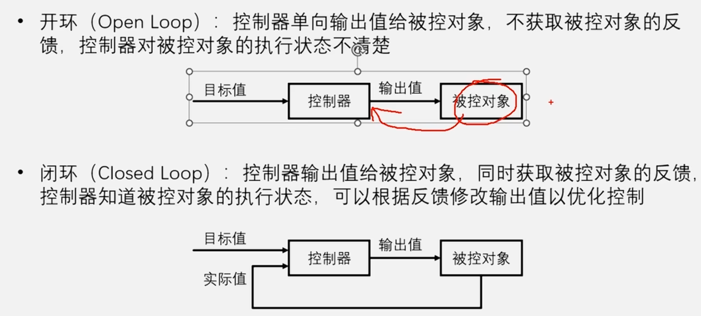

比如：PWM直接控制占空比就是开环的不精准的，电风扇就可以这么做，但是电机、电厂锅炉、汽车车速和横向位置、火箭姿态这种就不行

##### （3）PID公式与系统框图

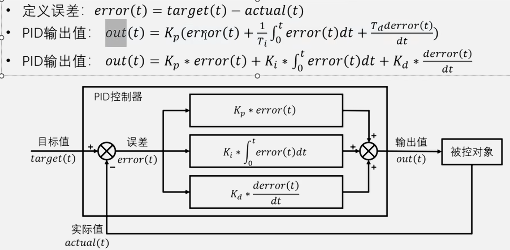

掌握第三个公式！！！
也就是PID三个参数的重点

###### 1.比例项P
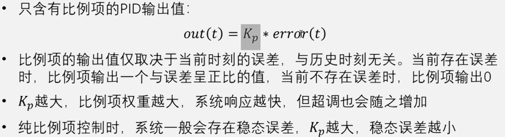

好处：反应快

坏处：***只调整P还是有稳态误差的原因：电机必然由于摩擦等***

###### 2.积分项I
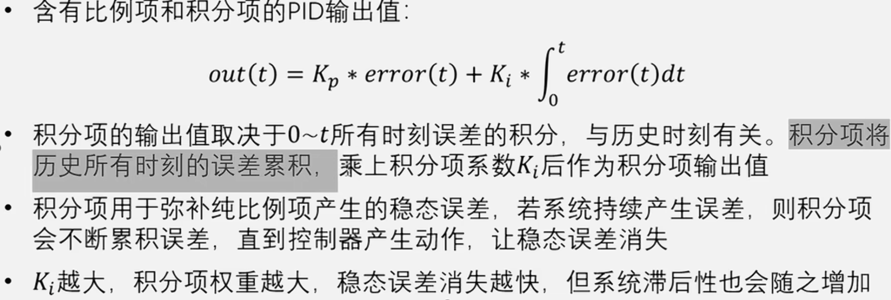

好处：积分项--对抗稳态误差
一般都是PI一起调整

弊端：系统滞后性，积分项，所以不稳定

###### 3.微分项D 
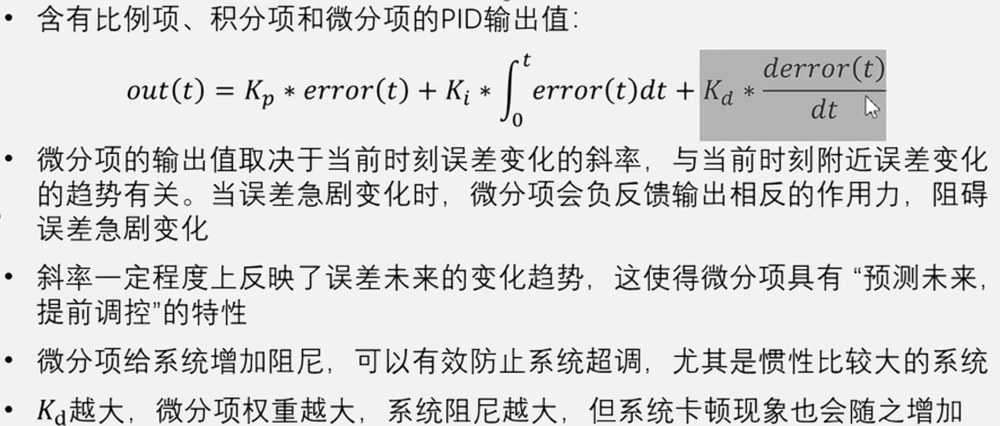

好处：避免超调，使用切线，没有D的话容易形成类似赛车的越调试越大的超调，本质上类似电磁阻尼的效果

##### (4)代码拟写：连续变成离散的才可以操作

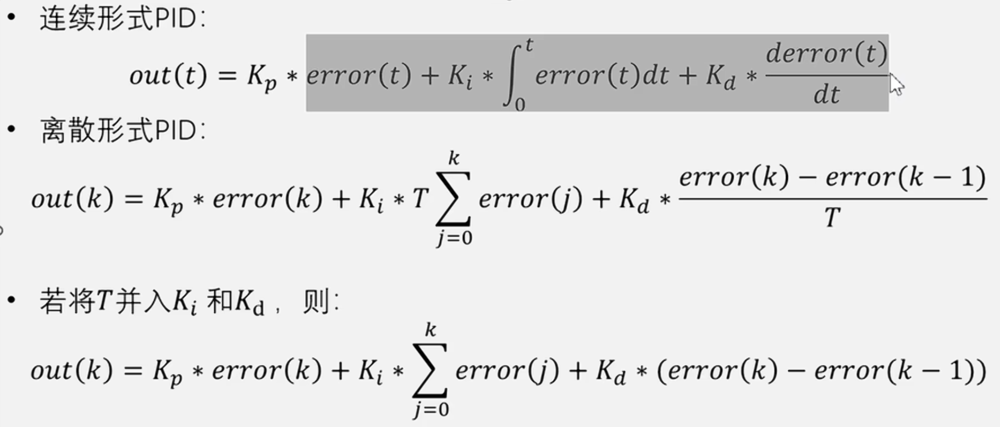

离散的才是真实的电路，模拟的才可以连续的

补充：位置式PID和增量式PID
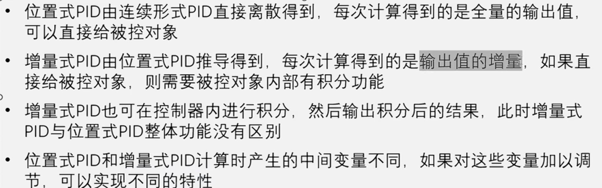


### 二、项目实践：丝滑的云台控制-P\D调参

##### 1.硬件引脚说明
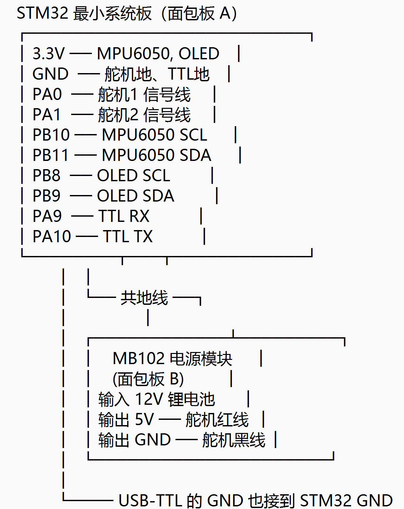

##### 2.完成步骤
```
┌─[阶段 A：烧录启动] ─────────────────────────────────────────────────┐
│ A1. OLED 完全不显示                                                 │
│ A2. 怀疑 OLED_Init / Serial_Init / MPU6050_Init / Servo_Init 卡死   │
│ A3. 写"HELLO"极简探针 → 仍不显示                                     │
│ A4. → 真相：未断电+按 RST 复位，STM32 没从 Flash 重启新代码           │
│ A5. 解决：断电重启                                                   │
└──────────────────────────────────────────────────────────────────────┘

┌─[阶段 B：MPU6050 读数验证] ──────────────────────────────────────────┐
│ B1. OLED 显示 Pit/Rol = +00.0，S1/S2 = 090                          │
│ B2. 串口输出 "0,0,9000,9000"（固定不变）                            │
│ B3. 怀疑 MPU6050 没出数 → 改 main 只读原始 AX/AZ                     │
│ B4. 串口收到 "-754,-19,2006,1"（数据正常！）                         │
│ B5. → 真相：burst 读法实现有 bug，单字节读法 OK                      │
│ B6. 解决：暂时用单字节读法，后续再优化                               │
└──────────────────────────────────────────────────────────────────────┘

┌─[阶段 C：TIM4 中断根本不进] ─────────────────────────────────────────┐
│ C1. TIM4 中断恢复后，OLED Pit/Rol 还是 0，舵机能动但被动             │
│ C2. 怀疑 TIM4 中断没进 → 加诊断字段 TK（中断进入计数）              │
│ C3. TK=00000 持续 0 → 确认 TIM4 没进                                 │
│ C4. 加寄存器探针 W/EN/CF/CNT/SR/CR1                                  │
│ C5. W=1234(可写)、EN=1(时钟开)、CF=4(预分频对)、CR1=1(CEN=1)         │
│ C6. 但 CNT=0000、SR=00 → 罕见"CR1 写 1 但 CEN 实际没置位"            │
│ C7. 加 5 层防御（关 Slave、UG 强制载入、while 确认 CEN）             │
│ C8. 第二次运行：CNT=44FA、SR=1E、TK=10 → 终于进了！但只进 10 次停   │
└──────────────────────────────────────────────────────────────────────┘

┌─[阶段 D：从 TIM4 换 TIM3] ───────────────────────────────────────────┐
│ D1. 怀疑 TIM4 通道 PB8/PB9 和 OLED 软件 I2C 引脚冲突                 │
│ D2. TIM4 CH3=PB8、CH4=PB9 = OLED I2C SCL/SDA                         │
│ D3. I2C 电平跳变触发 TIM4 CCxIF，和 UIF 争 SR 总线 → 清标志丢失      │
│ D4. 迁移到 TIM3（CH=PA6/PA7/PB0/PB1，不碰 OLED I2C）                  │
│ D5. 修了一处编译错误：TIM_OCMode_Frozen 在 F10x 标准库不存在        │
│ D6. 改用直接写 CCMR1/2=0、CCER=0 复位通道寄存器                      │
│ D7. 结果：T 还是只到 10 就停 → 根因不在引脚冲突！                    │
└──────────────────────────────────────────────────────────────────────┘

┌─[阶段 E：根因锁定——ISR 内软件 I2C 死锁] ───────────────────────────┐
│ E1. 现象：DIER=01(UIE=1)、SR=1E(UIF+CCxIF 都挂)、T=10、E=0          │
│ E2. 关键推理：                                                       │
│     - DIER UIE=1 说明中断已使能                                      │
│     - SR=1E 说明 UIF 一直挂起 → 中断请求一直发但 CPU 不响应          │
│     - 但 CR1=1 时钟在跑、CNT 也在涨                                  │
│     - → CPU 被锁在某个 ISR 里出不来                                  │
│ E3. 锁在哪？ISR 里调用 Attitude_Update → MPU6050_Read → 软件 I2C    │
│ E4. 软件I2C 的 MyI2C_WaitAck 等ACK 是 while(!SCL读电平) 死循环       │
│ E5. 偶发 ACK 失败 → while 永不退出 → CPU 锁死在 ISR                  │
│ E6. 主循环也跑不了 → OLED 显示"最后一帧冻结快照"                     │
└──────────────────────────────────────────────────────────────────────┘

┌─[阶段 F：终极方案——标志位调度] ──────────────────────────────────────┐
│ F1. TIM3_IRQHandler 只做：tick_cnt++; control_flag=1; 清 UIF         │
│ F2. 主循环检测 control_flag=1 时才执行 Control_Tick                  │
│ F3. 软件 I2C 永远在主循环里跑，永不卡 ISR                            │
│ F4. 验证：T 每秒+50、Pit/Rol 实时变、双舵机独立响应                  │
└──────────────────────────────────────────────────────────────────────┘

┌─[阶段 G：XCOM 串口调参输出] ─────────────────────────────────────────┐
│ G1. 之前串口乱码/只输出一行                                          │
│ G2. 原因：USART1 RXNE 中断和 TIM4 同级，乱码触发把 TIM4 饿死         │
│ G3. 解决：关闭 USART_IT_RXNE、USART1 NVIC 禁用                       │
│ G4. 恢复 Serial_Printf，每 100ms 发 6 列 CSV                         │
│ G5. 验证：XCOM 收到 "pitch*100,roll*100,s1*100,s2*100,tick,err"      │
└──────────────────────────────────────────────────────────────────────┘

┌─[阶段 H：丝滑度调参] ────────────────────────────────────────────────┐
│ H1. 现象：倾斜 MPU 后，舵机几秒钟一点一点挪到位                       │
│ H2. 原因：SLEW_MAX=3.0 限每 20ms 最多 3°，每秒最多 150°              │
│ H3. 摩擦大的机械云台被这个限幅钳成蜗牛                              │
│ H4. 解决：SLEW_MAX=0 先关闭，按需再开 8~12                           │
│ H5. Control.h 重写完整 P+D 调参流程注释                              │
└──────────────────────────────────────────────────────────────────────┘
```

##### 3.个人感悟与总结

>问题1：TIM4 通道引脚和 OLED I2C 冲突

| 现象 | TIM4 跑起来后，TK=10 就停，SR=1E（UIF+CCxIF 都挂起） |
|---|---|
| 原理 | TIM4 CH3=PB8、CH4=PB9，而 OLED 软件 I2C 也用 PB8/PB9（SCL/SDA）；I2C 电平跳变触发 CCxIF，和 UIF 争 SR 总线，清标志丢失 |
| 解决 | 迁移到 TIM3（CH=PA6/PA7/PB0/PB1，不碰 OLED I2C） |
| 经验 | **永远检查外设引脚复用！** STM32 引脚复用表必须查清楚 |
 
>问题2：ISR 内调用软件 I2C 死锁 CPU

| 项 | 内容 |
|---|---|
| 现象 | 换 TIM3 后 T 还是只到 10 就停，DIER=01、SR=1E、E=0、V=1 |
| 排查路径 | 关键推理：UIE=1 + UIF 一直挂起 = 中断请求一直发但 CPU 不响应 = CPU 被锁在 ISR 里 |
| 原理 | 软件 I2C 的 `MyI2C_WaitAck` 是 `while(!SCL 读电平)` 死循环；MPU6050 偶发 ACK 失败 → while 永不退出 → CPU 锁死在 ISR |
| 为什么换 TIM4→TIM3 没解决 | 问题不在引脚冲突（那是次要因素），而在 ISR 内调用了软件 I2C；TIM3 也一样会卡 |
| 解决 | **ISR 极简方案**：`TIM3_IRQHandler` 只做 `tick_cnt++; control_flag=1; 清 UIF`；`Control_Tick()` 移到主循环 |
| 经验 | **永远不要在 ISR 里调用阻塞型外设读取（软件 I2C/SPI/UART 轮询）！** ISR 必须 ≤ 几十条指令，最坏情况下也要有超时跳出 |

>问题3：XCOM 串口乱码 / 只有一行

| 项 | 内容 |
|---|---|
| 现象 | XCOM 收到乱码 "?唵?" 或只收到一行数据 |
| 原理 | USART1 RXNE 中断和 TIM4 抢占优先级相同（都是 1），同级不能嵌套；PA10 悬空/波特率错触发 RXNE 乱码，把 TIM4 饿死 |
| 解决 | 关闭 `USART_IT_RXNE` 中断、`USART1 NVIC` 设 DISABLE、TIM3 抢占优先级提到 0（最高） |
| 经验 | **只发不收的串口一定要关 RXNE 中断！** 否则悬空 RX 引脚的噪声会疯狂触发中断 |


---
---

## （四）附加题四：PCB板
#### 一、基础知识

###### 1.电路分析基础
###### 2.PCB结构与设计

步骤：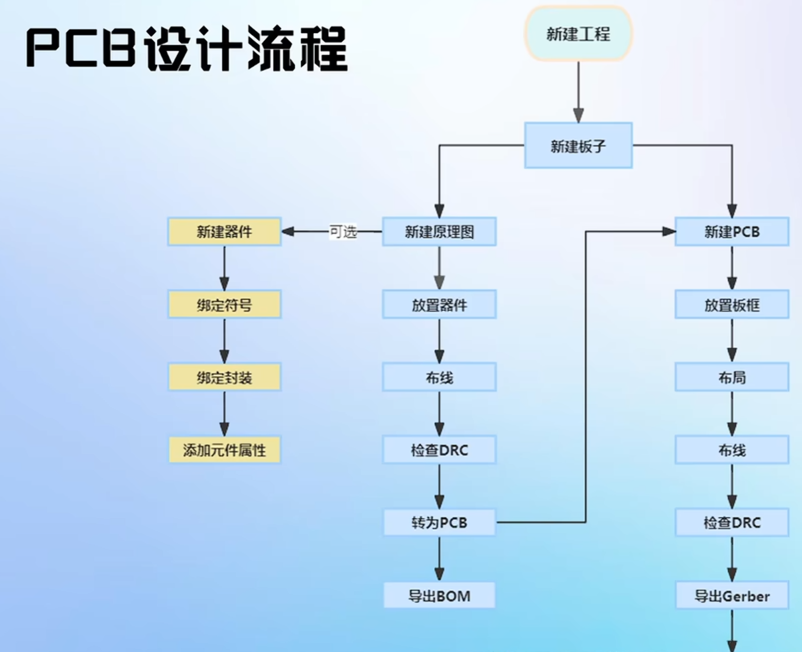

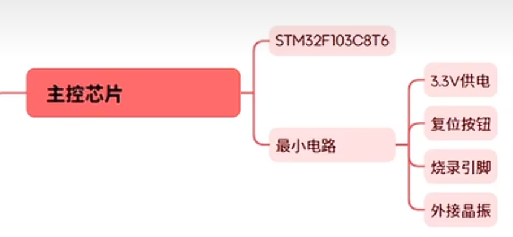

### 二、文档

#### 1.基础PCB元素

| 名称 | 嘉立创EDA图标特征 | 实物对应 | 功能用途 |
| :--- | :--- | :--- | :--- |
| **焊盘** | 金色/银色的圆形或方形金属区域 | PCB表面裸露的铜环，沉金或喷锡处理 | 元件引脚与PCB铜箔的电气连接点 |
| **过孔** | 带中心孔的小圆环，顶层底层各有焊盘 | PCB上的小圆孔，孔壁镀铜（外径0.6mm/内径0.3mm） | 连通顶层和底层走线 |
| **丝印** | 白色文字、线条或方框（顶层/底层丝印层） | PCB表面的白色字符和图案 | 标识元件位置和方向，辅助焊接与调试 |

#### 2.常用元器件

| 名称 | 嘉立创EDA图标特征 | 实物对应 | 功能用途 | **为什么要这样设计（设计依据）** |
| :--- | :--- | :--- | :--- | :--- |
| **电阻** | 矩形块（国内标准），位号R开头 | 贴片：黑色小方块（0603封装）；直插：色环圆柱体 | 限流、分压、上拉/下拉 | 依据STM32数据手册：NRST复位引脚需10kΩ上拉；依据I2C总线规范：SCL/SDA在3.3V下需4.7kΩ上拉以保证400kHz通信速率 |
| **电容** | 两条平行竖线（无极性）；直线+弯曲线（有极性），位号C开头 | 贴片：米黄色小方块；电解：带极性标记的小圆柱 | 滤波、去耦、储能 | 依据STM32数据手册：每个VDD引脚旁必须放置0.1μF（104）去耦电容，且须靠近引脚放置，否则芯片高速运行时电源抖动会导致复位或工作异常；晶振负载电容22pF依据晶振数据手册选型，须在5-25pF范围内 |
| **LED** | 二极管符号+两个向外箭头，位号LED开头 | 极小的有颜色贴片小方块，一端有极性标记 | 电源指示/程序运行状态指示 | 串联1kΩ限流电阻，依据LED数据手册：典型压降2.8V，电流需控制在2-5mA以内以防烧毁 |
| **Type-C** | 多引脚特殊接口符号，含VBUS/GND/CC等 | USB-C母座，支持正反插 | 供电输入（本项目仅用5V供电） | CC1/CC2各通过5.1kΩ下拉到地，依据USB Type-C规范，使电源适配器正确识别并输出5V |

#### 3.核心芯片模块

####  3.1 STM32F103C8T6最小系统

**为什么要这样设计（设计依据）**：
- **8MHz晶振**：依据STM32F103x8数据手册第6.3.3节，HSE外部时钟范围为4-16MHz，本设计选用8MHz晶振使PLL经9倍频后精确达到72MHz主频。两个22pF电容依据晶振负载电容要求，确保晶振稳定起振。
- **复位电路（10kΩ+0.1μF）**：依据数据手册第7.2.8节复位电路章节，NRST引脚内置施密特触发器，外部RC电路提供上电复位延时，确保芯片可靠启动。
- **BOOT0下拉（10kΩ）**：依据数据手册第2.4节启动配置，BOOT0=0时从主Flash启动。使用10kΩ电阻下拉而非直连GND，目的是为调试口保留ISP烧录能力。
- **去耦电容（0.1μF ×4）**：依据数据手册第4.1节电源方案建议，每个VDD引脚都需要就近放置去耦电容，滤除电源线上的高频噪声。
- **SWD调试接口**：依据Cortex-M3调试规范，SWD仅需SWDIO+SWCLK两根线即可完成烧录与调试，比JTAG节省引脚。
- **引脚分配说明**：MPU6050选用PB10/PB11（I2C2）而非PB6/PB7（I2C1），依据STM32F103x8勘误手册第2.14节，I2C1存在硬件死锁问题，I2C2无此问题，故选用I2C2以保证传感器通信稳定。

####  3.2 MPU6050六轴传感器

**为什么要这样设计（设计依据）**：
- **供电与滤波（0.1μF+10μF）**：依据MPU6050数据手册第3.3节电源要求，VDD需并联0.1μF和10μF电容，分别滤除高频和低频噪声，否则传感器数据抖动明显。
- **I2C上拉电阻（4.7kΩ×2）**：依据I2C总线规范，3.3V供电下4.7kΩ是400kHz快速模式的典型值，确保信号上升时间满足MPU6050手册第5.3节时序要求（Tr < 300ns）。
- **AD0接地**：依据数据手册第5.1节地址配置，AD0=0时I2C地址为0x68（7位），与使用0x69地址的终端设备不冲突。
- **布局要求**：依据数据手册第6.2节PCB布局建议，MPU6050应远离高频干扰源（晶振）和发热源（STM32主芯片），以减少对MEMS传感器的温度漂移和振动噪声影响。

####  3.3 HC-05蓝牙模块

**为什么要这样设计（设计依据）**：
- **串口连接（TX→RX，RX→TX）**：依据UART通信标准，收发交叉连接（蓝牙TXD→STM32的RXD，蓝牙RXD→STM32的TXD），才能实现双向通信。
- **VCC供电**：依据HC-05模块规格书，工作电压3.3-5V均可（内部集成LDO），本项目统一使用3.3V供电，简化电源设计，同时可与STM32的3.3V IO电平直接匹配，无需电平转换。
- **差分信号处理**：虽然UART本身是单端信号，但依据高速数字电路设计中的差分信号抗干扰原理，将TX/RX差分走线后，外界共模干扰在两线上产生相同噪声，接收端差分比较后相互抵消。在无人机电机强电磁干扰环境下，差分走线实测可显著降低串口通信误码率。

### 3.4 按键电路

**为什么要这样设计（设计依据）**：
- **内部上拉**：依据STM32数据手册第6.3.9节GPIO特性，IO口内部集成约40kΩ上拉电阻，可通过软件配置启用。按键一端接GPIO、一端接地，利用内部上拉即可实现按键检测（按下为低电平），省去外部上拉电阻，节省PCB空间和BOM成本。

##### 整体原理图设计思路

| 设计决策 | 设计依据 | 来源 |
| :--- | :--- | :--- |
| 选用8MHz晶振实现72MHz主频 | PLL 9倍频，最高频率72MHz | STM32F103x8数据手册 |
| 每个VDD引脚放0.1μF去耦电容 | 确保高频去耦，防止电源噪声 | STM32F103x8数据手册第4.1节 |
| 复位电路用10kΩ上拉+0.1μF | 保证上电可靠复位 | STM32F103x8数据手册第7.2.8节 |
| BOOT0通过10kΩ下拉到GND | 从主Flash启动 | STM32F103x8数据手册第2.4节 |
| I2C用PB10/PB11（I2C2） | 规避I2C1硬件勘误问题 | STM32F103x8勘误手册第2.14节 |
| I2C总线用4.7kΩ上拉到3.3V | 保证400kHz通信速率 | I2C总线规范 + MPU6050数据手册 |
| MPU6050加0.1μF+10μF滤波 | 滤除高频+低频电源噪声 | MPU6050数据手册第3.3节 |
| UART差分走线处理 | 提升抗共模干扰能力 | 差分信号原理 |
| HC-05用3.3V供电 | 与STM32 IO电平直接匹配 | HC-05模块规格书 |
| Type-C的CC脚接5.1kΩ下拉 | 让适配器识别并输出5V | USB Type-C规范 |

### 三、我的项目实践（导出在另一个文件夹里面的）

以下是我绘制PCB板之前绘制的原理图，以及通过原理图导入进行走线后的PCB板，以及3D显示的绘制好的PCB板，以及我的DRC检查

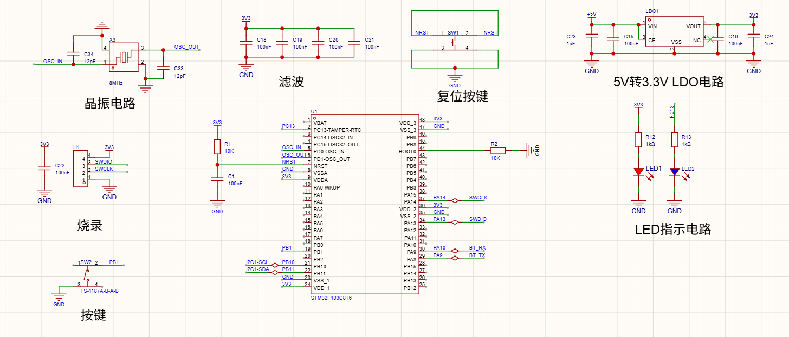
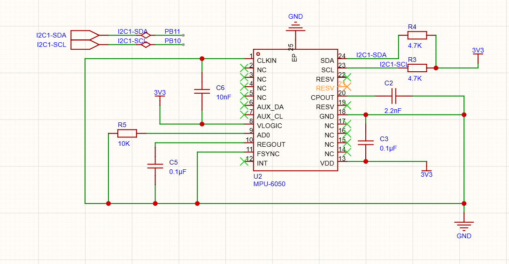
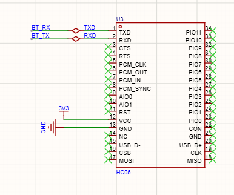
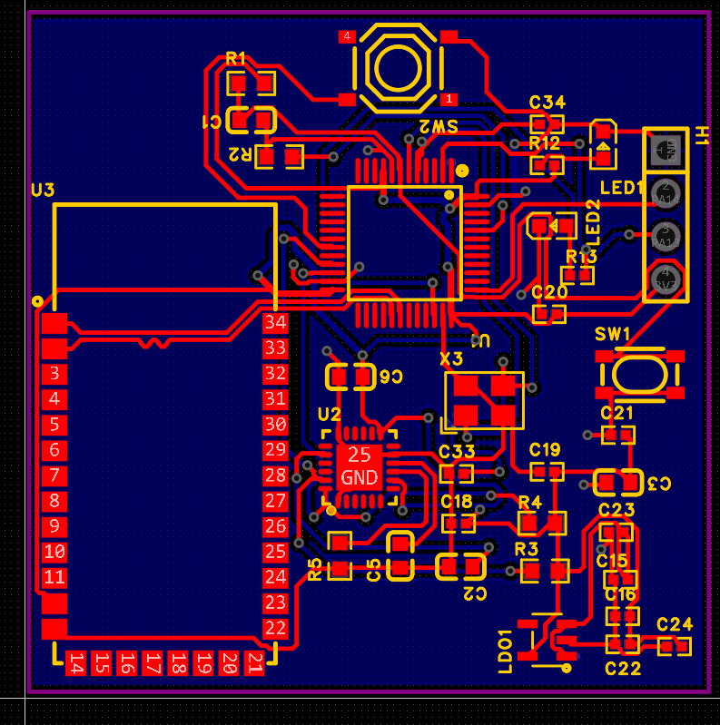
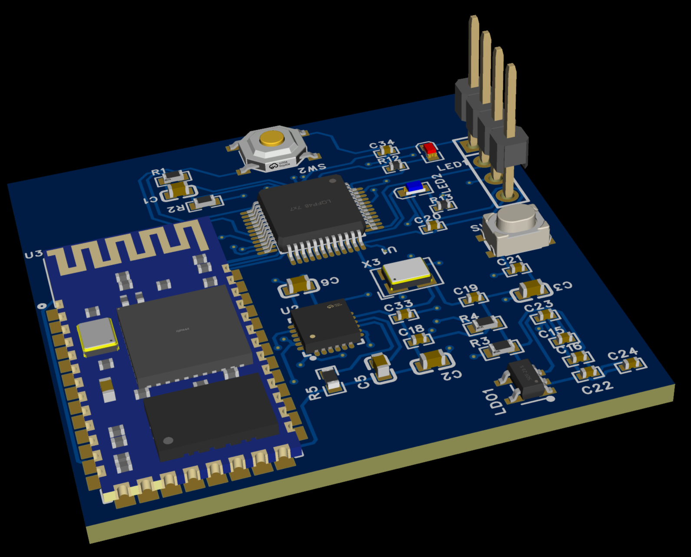
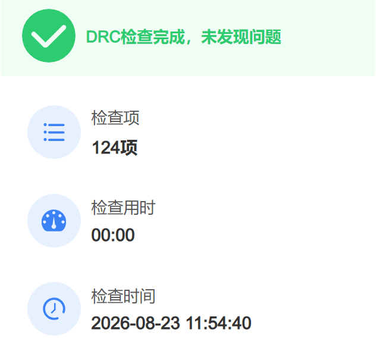


---

## 【附件1】挑战点四-硬件引脚规划文档


### 一、现有引脚资源占用清单

#### 1.第一种方案引脚资源占用

通过对当前项目源码的完整审查，第一种方案已占用的硬件资源如下表所示：

| 序号 | 模块 | 引脚 | 功能 | GPIO 模式 | 信号类型 | 电平标准 | 占用来源 |
|------|------|------|------|-----------|---------|---------|---------|
| 1 | 舵机 PWM | PA0 | TIM2_CH1 PWM 输出 | AF_PP | 输出 | 3.3V CMOS | PWM.c |
| 2 | 蓝牙 TX | PA9 | USART1_TX | AF_PP | 输出 | 3.3V CMOS | Serial.c |
| 3 | 蓝牙 RX | PA10 | USART1_RX | IPU | 输入 | 3.3V CMOS | Serial.c |
| 4 | OLED SCL | PB8 | 软件 I2C 时钟线 | Out_OD | 双向 | 3.3V 开漏 | OLED.c |
| 5 | OLED SDA | PB9 | 软件 I2C 数据线 | Out_OD | 双向 | 3.3V 开漏 | OLED.c |
| 6 | MPU6050 SCL | PB10 | 软件 I2C 时钟线 | Out_OD | 双向 | 3.3V 开漏 | MyI2C.c |
| 7 | MPU6050 SDA | PB11 | 软件 I2C 数据线 | Out_OD | 双向 | 3.3V 开漏 | MyI2C.c |
| 8 | 模式切换按键 | PB1 | 按键输入 | IPU | 输入 | 3.3V 上拉 | Key.c |


**方案 A 特点**：
- MPU6050 与 OLED 各占一组 I2C 引脚（PB10/PB11 和 PB8/PB9），**两条独立总线互不干扰**，调试时定位问题更容易。


#### 2.第二种方案引脚资源占用（方案 B：优化精简版）

在方案 A 的基础上，利用 I2C 总线**多设备挂载**特性，将 MPU6050 与 OLED 共用同一组软件 I2C 引脚，释放 PB10/PB11 供其他功能使用。

| 序号 | 模块 | 引脚 | 功能 | GPIO 模式 | 信号类型 | 电平标准 | 占用来源 |
|------|------|------|------|-----------|---------|---------|---------|
| 1 | 舵机 PWM | PA0 | TIM2_CH1 PWM 输出 | AF_PP | 输出 | 3.3V CMOS | PWM.c |
| 2 | 蓝牙 TX | PA9 | USART1_TX | AF_PP | 输出 | 3.3V CMOS | Serial.c |
| 3 | 蓝牙 RX | PA10 | USART1_RX | IPU | 输入 | 3.3V CMOS | Serial.c |
| 4 | MPU6050 SCL | **PB8** | 软件 I2C 时钟线 | Out_OD | 双向 | 3.3V 开漏 | MyI2C.c |
| 5 | MPU6050 SDA | **PB9** | 软件 I2C 数据线 | Out_OD | 双向 | 3.3V 开漏 | MyI2C.c |
| 6 | OLED SCL | **PB8**（共用） | 软件 I2C 时钟线 | Out_OD | 双向 | 3.3V 开漏 | OLED.c |
| 7 | OLED SDA | **PB9**（共用） | 软件 I2C 数据线 | Out_OD | 双向 | 3.3V 开漏 | OLED.c |
| 8 | 模式切换按键 | **PB1** | 按键输入 | IPU | 输入 | 3.3V 上拉 | Key.c |


**方案 B 特点总结**：
- **节省 2 个 GPIO**（PB10/PB11 被释放），可用于后期扩展。
- 原理上完全可行：I2C 总线支持**多从机挂载**，MPU6050 的从机地址是 `0x68`，OLED 的从机地址是 `0x3C`（或 `0x3D`），**地址不同，通信时通过地址区分设备，互不干扰**。

### 二、模块间 GPIO、定时器资源冲突点（如 PWM 定时器、UART 串口复用冲突）


| 序号 | 冲突类型 | 涉及引脚/外设 | 风险描述 | 在方案 A 中是否存在 | 在方案 B 中是否存在 |
| :--- | :--- | :--- | :--- | :--- | :--- |
| 1 | **PWM 定时器通道独占** | TIM2 的多个 CH | TIM2_CH1（PA0）被舵机占用，若需控制第二路舵机，需使用 TIM2_CH2（PA1）或其他定时器；多个通道可同时使用，但共用一个 ARR 周期，占空比独立 | 不冲突（只用了 1 路） | 不冲突（只用了 1 路） |
| 2 | **USART1 引脚独占** | PA9（TX）、PA10（RX） | 蓝牙模块独占 USART1，若需同时使用有线串口调试，需另开 USART2 或重映射 | 不冲突（仅用 USART1） | 不冲突（仅用 USART1） |
| 3 | **硬件 I2C 与软件 I2C 的取舍** | PB6/PB7（硬件 I2C1） | 本项目使用**软件 I2C**，GPIO 处于普通开漏模式，不开启硬件 I2C 外设时钟，**彻底规避了硬件 I2C 与 SPI、UART 的引脚复用冲突** | 不冲突（软件模拟） | 不冲突（软件模拟） |
| 4 | **OLED 与 MPU6050 共用总线时的总线仲裁** | PB8（SCL）、PB9（SDA） | 仅方案 B 涉及：两个 I2C 设备挂载在同一总线上，需保证从机地址不同，否则通信冲突 | 不涉及 | **需注意**：MPU6050 地址 `0x68` vs OLED 地址 `0x3C`，地址不同，**无冲突风险** |


### 三、模块间资源冲突解决方案（如更换定时器通道、复用功能引脚等）


| 序号 | 冲突场景 | 解决方案 |
| :--- | :--- | :--- | 
| 1 | 需要第二路舵机（两轴云台） | 方案 A：使用 **TIM2_CH2（PA1）** 或 **TIM3_CH1（PA6）/TIM3_CH2（PA7）** 作为第二路 PWM 输出；需注意 TIM2 的多个通道共用同一个 ARR（周期），无法独立设置频率，但占空比可独立调节 | 
| 2 | 需要有线串口调试 + 蓝牙同时使用 | 蓝牙使用 **USART1（PA9/PA10）**，调试串口使用 **USART2（PA2/PA3）** 或 **USART3（PB10/PB11）**（注意方案 B 中 PB10/PB11 已被释放，可作此用途） |
| 3 | 软件 I2C 速率不够 | 减小 `Delay_us(10)` 中的延时值（如改为 `Delay_us(5)`），可提升 I2C 时钟频率；但需确保从机（MPU6050/OLED）支持该速率 |
| 4 | 硬件 I2C 与 SPI 引脚复用冲突 | **本项目已彻底规避**：使用软件 I2C 模拟时序，GPIO 处于普通开漏模式，不开启硬件 I2C 外设时钟，释放 PB6/PB7 供 SPI/其他用途 |
| 5 | 共用总线（方案 B）出现通信紊乱 | 确认 MPU6050 地址为 `0x68`，OLED 地址为 `0x3C`（或 `0x3D`）；若设备地址冲突，可通过 AD0 引脚调整 MPU6050 地址（AD0=0→0x68，AD0=1→0x69），或调整 OLED 的 SA0 引脚 |

