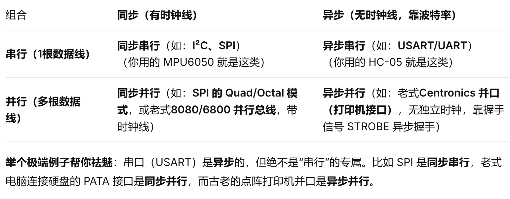

嵌入式系统是一种面向特定应用、以计算机技术为基础，软硬件可裁剪，嵌入到目标设备中的专用计算机系统。

PC主要是通用计算机系统，而嵌入式系统通常针对特定应用进行设计。

MCU 是硬件核心，嵌入式系统是由硬件、软件以及外围组成的完整系统。

MCU = CPU + 存储器 + 各种外设。

STM32F103C8T6 使用的 ARM Cortex-M3 内核采用改进型哈佛架构。它具有独立的指令和数据访问通路，可以提高指令获取与数据访问的并行性；但其内存组织又采用统一的地址空间，因此不能简单等同于最经典的纯哈佛架构。

